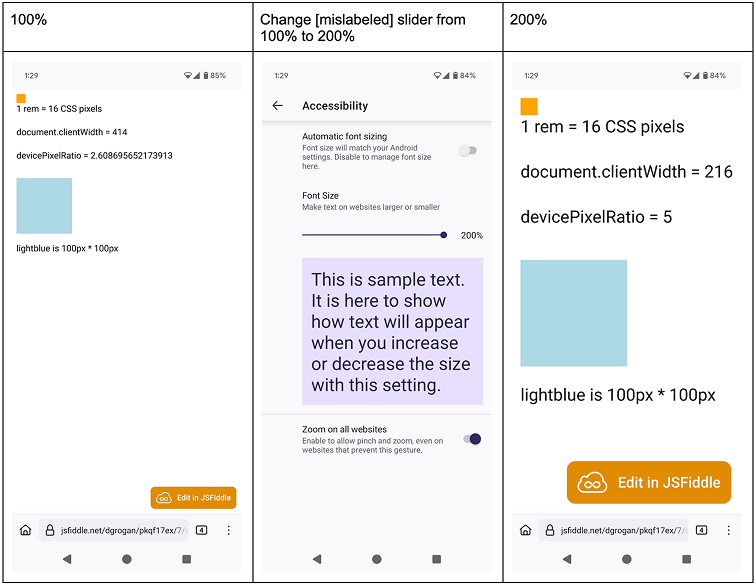
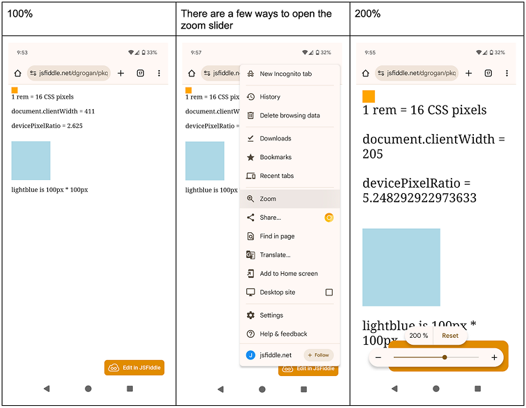
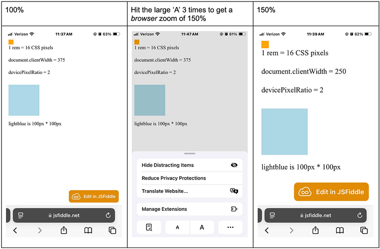

# Explainer: `env(preferred-text-scale)`

## Authors

- David Grogan (@davidsgrogan), Google
- Josh Tumath (@JoshTumath), BBC
- Philip Rogers (@progers), Google
- Ian Kilpatrick (@bfgeek), Google

## Table of contents

<!-- TOC start (generated with https://github.com/derlin/bitdowntoc) -->

- [Introduction](#introduction)
- [Background](#background)
- [Existing user controls to scale content](#existing-user-controls-to-scale-content)
  - [Browser zoom](#browser-zoom)
    - [Firefox on Android – global zoom slider labelled as “Font Size”](#firefox-on-android--global-zoom-slider-labelled-as-font-size)
    - [Chrome on Android – per-site zoom slider](#chrome-on-android--per-site-zoom-slider)
    - [Safari/iOS – per-site zoom buttons](#safariios--per-site-zoom-buttons)
    - [Authors can induce browser zoom](#authors-can-induce-browser-zoom)
    - [How authors detect and respond to browser zoom](#how-authors-detect-and-respond-to-browser-zoom)
  - [Visual zoom (pinch-to-zoom)](#visual-zoom-pinch-to-zoom)
    - [How authors detect and respond to visual zoom](#how-authors-detect-and-respond-to-visual-zoom)
  - [UA-level font setting](#ua-level-font-setting)
    - [Firefox on desktop OSs](#firefox-on-desktop-oss)
    - [Chrome and Edge on desktop OSs](#chrome-and-edge-on-desktop-oss)
    - [Safari on macOS](#safari-on-macos)
    - [Mobile browsers](#mobile-browsers)
    - [How authors detect and respond to UA-level font setting](#how-authors-detect-and-respond-to-ua-level-font-setting)
  - [OS-level font setting](#os-level-font-setting)
    - [Safari on iOS – no effect on sites](#safari-on-ios--no-effect-on-sites)
    - [Chrome on Android – usually no effect](#chrome-on-android--usually-no-effect)
    - [macOS – no effect](#macos--no-effect)
    - [Windows 11](#windows-11)
    - [How authors detect and respond to OS-level font setting](#how-authors-detect-and-respond-to-os-level-font-setting)
- [Proposal](#proposal)
  - [Pros and cons](#pros-and-cons)
  - [Privacy](#privacy)
  - [How authors will use `env(preferred-text-scale)`](#how-authors-will-use-envpreferred-text-scale)
  - [Note: Android Webview](#note-android-webview)
  - [Example use cases](#example-use-cases)
- [FAQ](#faq)
  - [The WebKit `-apple-system-*` fonts give a range of font sizes that correspond to different use cases. This proposal doesn’t fit that model.](#the-webkit--apple-system--fonts-give-a-range-of-font-sizes-that-correspond-to-different-use-cases-this-proposal-doesnt-fit-that-model)
  - [How do I test this text scaling?](#how-do-i-test-this-text-scaling)
  - [What about the minimum font size a user has selected?](#what-about-the-minimum-font-size-a-user-has-selected)
- [Alternatives considered](#alternatives-considered)
  - [New meta viewport key for changing text-scale](#new-meta-viewport-key-for-changing-text-scale)
  - [Fold OS-level font scale into initial font size](#fold-os-level-font-scale-into-initial-font-size)

<!-- TOC end -->

## Introduction

Operating systems and web browsers provide global accessibility settings for the user to increase their system text scale.[^1] Authors would like to respect the user’s text scale settings.

However, when the user increases the text scale, website text either doesn’t scale or the browser will do a full page zoom (where everything – not just text – scales). The web platform has no standardised native way to respect the user’s text scale setting and adjust the layout accordingly to fit the scaled text.

Both authors and users have lamented this lack of support, _especially on mobile_, where <kbd>Ctrl</kbd> <kbd>+</kbd>/<kbd>-</kbd> isn’t as convenient, where pages can be embedded in app Web Views and where screen space is at a higher premium.

We [propose](https://github.com/w3c/csswg-drafts/issues/10674) to provide authors with access to the user’s system font scale factor via a new CSS environment variable: `env(preferred-text-scale)`.

## Background

Research has shown that around 37% of Android users and 34% of iOS users have changed their system-level font scale factor from the default.[^2]

However, browsers can’t simply apply the user’s system-level font scale to all web pages, because – if they did – **many** existing page layouts would break, causing content to be invisible or to lose interactivity.

Mobile browsers use certain heuristics to control when to automatically inflate text size – particularly on web pages that don’t use the `<meta viewport>` tag. The text auto-sizing can be controlled using the `text-size-adjust` property and can be disabled by setting it to `none`. Text auto-sizing does not happen on desktop browsers.


_reddit today with Blink’s text autosizing. Notice the heuristics non-uniformly scale comment font size._

Browsers provide the user various methods to scale the text or to zoom the entire content per-page or per-site. Browsers have generally moved away from text scaling (or ‘text zoom’) and instead do full zoom (or ‘browser zoom’), which expands every box on the page, regardless of whether they were sized with a font-relative unit (like em) or physical unit (like px).


_BBC Sport live page with 200% full page zoom._

However, many of these methods aren’t available to the user when interacting with a Web View (where a browser frame is embedded in a native app).


_BBC Sport live page on iOS rendered in an iOS WebView. The user has increased the OS text scale but it has had no effect on the embedded web content._

## Existing user controls to scale content

Past discussions about this space have revealed confusion over the different types of content scaling and how browsers support each of them. So in this section we survey the various controls _users_ have and how _authors_ can account for these preferences.

### Browser zoom

Browser zoom works the same on all browsers. (<kbd>Ctrl</kbd>/<kbd>Cmd</kbd> <kbd>+</kbd>/<kbd>-</kbd> on desktop, zoom slider on Chrome/Android, zoom control in the menu to the left of the url bar on Safari/iOS)

Characteristics of browser zoom / full zoom:

- _All_ content on the page is enlarged, regardless of whether it is sized with a font-relative unit (like `em`) or physical unit (like `px`)
- The logical viewport size is reduced
- `devicePixelRatio` changes
- The document’s `width` in CSS pixels changes
- Initial `font-size` does not change – still 16 CSS pixels

Browser zoom can cause content to overflow the inline viewport edge, meaning users have to do _lawnmower swiping_ (swiping back and forth) to read the content of the page. Lawnmower swiping is a poor user experience.

Further, authors usually don’t want padding / spacing between elements to change by the same factor as text, but this happens with Browser zoom, leading to a subpar design.

#### Firefox on Android – global zoom slider labelled as “Font Size”



#### Chrome on Android – per-site zoom slider



#### Safari/iOS – per-site zoom buttons



> [!NOTE]
> devicePixelRatio _did_ change in the image on the right, but [Safari has a bug](https://bugs.webkit.org/show_bug.cgi?id=124862) about changing the value exposed at `window.devicePixelRatio`.

#### Authors can induce browser zoom

Authors can use the CSS [`zoom` property](https://drafts.csswg.org/css-viewport/#zoom-property) to zoom on any element, including the root element.

```css
:root {
  zoom: 3;
}
```

> [!NOTE]
> The proposed `env(preferred-text-scale)` _could_ be used with this property via `zoom: env(preferred-text-scale)`, though we suspect there are not many appropriate applications for this usage. Perhaps full-screen games rendered in a `canvas`.

Note that, unlike actual browser zoom, the zoom property – when applied to the root element – will _not_ affect media queries.

#### How authors detect and respond to browser zoom

- Media queries
- Container queries
- Intrinsic layout methods (for example, intrinsic grids, wrapping flex layouts)
- WebGL canvases tend to adjust for `devicePixelRatio`

### Visual zoom (pinch-to-zoom)

Visual zoom – known to most people as pinch-to-zoom – only expands the visual rendering. It has no effect on the content.

Users on mobile frequently do visual zoom, specifically because sites can’t and don’t respond well to OS-level font preferences. These users have to do lawnmower swiping (swiping back and forth) to read the content of the page. Lawnmower swiping is more common with Visual zoom than with Browser zoom. As previously mentioned, lawnmower swiping is a poor user experience.

> [!NOTE]
> Visual zoom is not affected by this proposal.

#### How authors detect and respond to visual zoom

Authors rarely need to respond to visual zoom.

- The CSS [`touch-action` property](https://developer.mozilla.org/en-US/docs/Web/CSS/touch-action) can limit or disable visual zoom
- The `window.visualViewport.scale` property returns the amount of visual zoom

### UA-level font setting

UA-level font scale controls let the user override the initial `font-size` value `medium` (which is _de facto_ 16px otherwise). Doing so adjusts the other [absolute font size keywords](https://drafts.csswg.org/css2/#value-def-absolute-size) as well.

Because the UA’s initial font-size gets changed, media queries that use font-relative units like `em` or `rem` _are_ affected by the UA-level font setting.

> [!NOTE]
> Unless the author overrides the root element’s font-size property, `rem` units are relative to the UA’s initial `medium` font-size.

Also note that engines cannot simply delegate the UA-level font setting to the OS-level font setting (which would mean that the initial root font-size `medium` would be affected by the OS-level font setting). If they did, many websites’ layouts that aren’t designed to adapt to larger font sizes would break. This breakage stems from the fact that, empirically, the number of users who change the OS-level font setting are greater than the number of users who change the UA-level font settings.

Authors have tried to correctly use `rem` and `em` units to respond to UA-level font changes, but have not been very successful. (If you change your UA-level font setting and browse the web, especially in a mobile emulator, you’ll see that many pages are broken. We hypothesize that authors aren’t aware of this breakage because so few users are affected by it.)

#### Firefox on desktop OSs

Firefox users can explicitly set a default font size in pixels, or enable ‘zoom text only’. Both will affect the UA’s initial font-size.


#### Chrome and Edge on desktop OSs

Chrome and Edge users can explicitly set a default font size in pixels. Doing so will affect the UA’s initial font-size.


#### Safari on macOS

Safari users can change the `initial` font-size per-domain by holding down the Opt key on the keyboard. When doing so, the ‘Zoom In’ and ‘Zoom Out’ menu items change to ‘Make Text Bigger’ or ‘Make Text Smaller’.


Safari also has a minimum font size setting:


#### Mobile browsers

Currently, the most popular mobile browsers do not provide controls to change the UA initial font-size.

#### How authors detect and respond to UA-level font setting

- Strategically using font-relative units like `em` and `rem` where appropriate, both in sizing content and in media queries.

### OS-level font setting

Today, mobile OS-level font settings _typically_ have no effect on a web page. On desktop OSs, the effect varies.

Unlike the UA font scale setting, the initial `font-size` value `medium` _does not change_ when the OS-level font setting is set to a non-default value – it’s still `16px`.

#### Safari on iOS – no effect on sites


When text is scaled with `text-size-adjust: auto`, the inflation algorithm is not affected by the OS-level font setting:


#### Chrome on Android – usually no effect

The _majority_ of sites are _not_ affected by the OS-level font slider. For example, WaPo:


However, for the _few_ sites where Blink’s text autosizer ([bookmark](#bookmark=id.l7iog84mbwue)) scales text (with `text-size-adjust: auto)`, the inflation algorithm _does_ use the OS-level font setting, as can be seen in this contrived example:


#### macOS – no effect

Not many native macOS apps seem to scale.


#### Windows 11

Chrome, Edge and Firefox all do a full browser zoom of both the _browser’s UI_ **and** the web page.


_Notice how large the tab strip is in all 3 Desktop browsers compared to the Windows taskbar_

#### How authors detect and respond to OS-level font setting

There is currently no standardised way to detect or respond to the OS-level font setting. Authors often ask how to do it.[^3] _This is the shortcoming this proposal aims to address._

##### Measuring text

Using a client-side script, it is possible for an author to measure a run of text that has been scaled using `text-size-adjust`. That is the strategy described by this very long [stackoverflow answer](https://stackoverflow.com/questions/62151458/how-to-detect-android-devices-default-font-size-with-css-media-queries/62215802#62215802) that only works on pages in WebView. It won’t even detect OS-level font settings on the open web. This StackOverflow answer illustrates what authors are willing to go through to get this value, even for WebView only.

[google.com](http://google.com) performs a variant of this reverse-engineering strategy, but on the open web. It involves displaying the word “Google” 40x offscreen and measuring the resulting bounding box.

##### iOS’s non-standard approach

[WebKit supports proprietary vendor-prefixed font keywords.](https://webkit.org/blog/3709/using-the-system-font-in-web-content/) They can only be used in the `font` shorthand property, so they also override `font-family`, `font-weight`, etc. Authors can include the following in their stylesheet.

```css
:root {
  font: -apple-system-body;
}

body {
  font-family: sans-serif;
  font-style: initial;
  font-weight: initial;
}
```

When the OS-level font settings are set to the default, the font-size returned by `-apple-system-body` is different to the _de facto_ 16px initial font-size. (It is a likely reason why this non-standard approach is not used widely.)

[google.com](http://google.com) also reverse engineers the OS-level font setting on iOS devices by using `-apple-system-body` and measuring the text’s resulting bounding box.

> [!NOTE]
> You can observe the properties by opening this web page on Safari: [iOS System Fonts Test.](https://ia11y.github.io/Coding-Patterns/iOS/text-resizing/ios-system-fonts.html) Observe how the ‘a’ ‘A’ zoom buttons on Safari on iOS change these fonts at different proportions, as specified in the [Apple Human Interface Guidelines.](https://developer.apple.com/design/human-interface-guidelines/typography#Specifications)

## Proposal

We [propose](https://github.com/w3c/csswg-drafts/issues/10674#issuecomment-2613047477) a new [CSS environment variable](https://drafts.csswg.org/css-env-1/#env-function), provisionally named `env(preferred-text-scale)`, that exposes the user’s text scale preference as a unitless scalar. ([Draft spec](https://drafts.csswg.org/css-env-1/#text-zoom).) In the default scenario where the user has not changed any text scale settings, the value is 1. If the user doubles the text scale, the value is 2. Likewise, if the user halves the text scale, the value is 0.5.

The scalar value is determined by the UA using text scaling settings in the OS and/or the UA.

> [!NOTE]
>
> **Example 1:** On Android where there is no UA-level setting, if the user increased the OS-level ‘font size’ setting as shown below, `env(preferred-text-scale)` would return 1.3.
>
> 
>
> **Example 2:** On macOS and iOS, if the user increased the ‘text size’ setting from the default 12pt to 20pt, the increase is 66.666…%. Therefore, the UA may set the value of `env(preferred-text-scale)` to 1.666….
>
> 
>
> **Example 3:** Or, if a macOS user set their UA-level font-size from the default 16px to 24px, while leaving their OS-level ‘Text Size’ unchanged, `env(preferred-text-scale)` would return 1.5.
>
> 

If the user sets the text scaling settings in both the OS and UA, the UA may set the scalar value to be a product of the two.

> [!NOTE]
> It is rare for any browser to support both UA-level and OS-level font controls. For Chrome, it only happens on Windows.

On UAs that account for text scale settings by doing a full-application zoom or full-page zoom, the UA should set the value to 1. Otherwise, page content could be scaled twice: by both the UA and the author’s stylesheet.

### Pros and cons

Pros

- Drop-in replacement for sites that were using hacky ways to detect this value
- Allows gradual adoption of the feature

Cons

- Requires authors to dedicate time to determine which parts of their pages should get which treatment (see below for examples).

### Privacy

A member of the TAG [raised a concern that the proposed environment variable is a fingerprinting risk.](https://github.com/w3c/csswg-drafts/issues/10674#issuecomment-2686534296)

> Letting users pick an arbitrary value that'll be given to all the sites they browse, tends to divide them into buckets that are too identifying. But it might work to define a set number of buckets that give a close-enough approximation to each user's ideal font size.

To mitigate these concerns, Blink has implemented bucketing. Blink’s implementation maps the real-valued preferred scale provided by the OS into a predefined set of 7 discrete buckets.

We acknowledge that bucketing _does_ lead to a _subpar user experience_ on platforms that give more scale options than the number of Blink’s predefined buckets, or whose options don’t align closely with the predefined buckets.

### How authors will use `env(preferred-text-scale)`

#### Changing the root font-size

We recommend this as best practice, but it might not be practical to do on an existing complicated page.

```css
:root {
  font-size: calc(100% * env(preferred-text-scale));
  /* To prevent double scaling, disable the mobile browser's heuristic-based
   * autosizer: */
  text-size-adjust: none;
}
```

#### Explicitly adjusting the text size

Authors can use the `text-size-adjust` property to selectively boost the font size and line height of certain elements. Note that currently, `text-size-adjust` only has an effect on mobile browsers, but mobile browsers are where text boosting is more prominently needed.

```css
:root {
  text-size-adjust: calc(100% * env(preferred-text-scale));
}
```

OR

```css
:root {
  text-size-adjust: none;
}

.article-body {
  text-size-adjust: calc(100% * env(preferred-text-scale));
}
```

#### Changing a layout

Authors can use `env(preferred-text-scale)` in media queries and container queries.

```css
.sidebar-layout {
  display: grid;

  @media (width > calc(50rem * env(preferred-text-scale))) {
    grid-template-columns: 1fr 18rem;
  }
}
```

> [!NOTE]
> While font-relative units like `rem` aren’t affected in media queries, they are in container queries. Therefore, if the root font-size is changed with `env(preferred-text-scale)`, there is no need to reference it in a container query; the author can use `rem` units.

#### Altering the rate of scaling

If an author didn’t want headings – for example – to scale up at the same rate as body text, they could modify the scalar value provided by `env(preferred-text-scale)`.

### Note: Android Webview

By default, [Android Webview scales the text size by the system font scale factor](https://crsrc.org/c/android_webview/java/src/org/chromium/android_webview/AwSettings.java;l=382-385;drc=fbd39d07c1deaf2ec4a8ea32260503369d10bdbb). App developers may override this default by invoking [setTextZoom()](<https://developer.android.com/reference/android/webkit/WebSettings#setTextZoom(int)>).

**Update 2025-Jul-08:** The interaction between WebView and env() is in flux. See the [discussion on blink-dev.](https://groups.google.com/a/chromium.org/g/blink-dev/c/bZuQAcwcEig/m/6F5w5S97AQAJ)

<del>
We recommend that apps embedding pages that use `env(preferred-text-scale)` override Android Webview’s default scaling with `setTextZoom(100)`. But `text-size-adjust` doesn’t work in Android Webview yet. See [https://crbug.com/419469463](https://crbug.com/419469463)
</del>

### Example use cases

#### Example 1: reddit

Reddit is one of the few sites on the web where Blink’s text autosizer still has an effect.

_reddit.com in scenarios where the user has selected a 2x OS-level font scale_


- [1] Notice the text autosizer heuristics non-uniformly scale comment font size.
- [2] I.e. with `body { text-size-adjust: none; }` Comments are probably too small to read for someone who requested 2x font sizes
- [3] I.e. with `body { text-size-adjust: calc(env(preferred-text-scale) * 100%); }` Notice how the blue snoo is cut off. The implication is that authors will unlikely be able to blindly apply this to every element on existing pages; layouts will have to be adjusted or preferred-text-scale will have to be applied selectively.
- [4] With `.text-14 { text-size-adjust: calc(env(preferred-text-scale) * 100%); }` A quick first attempt at selectively applying preferred-text-scale. It is applied just to the comments. Now, all comments are scaled uniformly. This represents an improvement over the other three options. But a similar rule might have to be applied to other parts of the page as well, such as increasing the size of the header, buttons, etc.

#### Example 2: Google search

Google search currently detects the OS font scale factor by measuring text and adjusting styles throughout the page. Because they do not have env(preferred-text-scale), they do this measurement post-load, store the result, and only apply scaled styles on subsequent page loads. For complex existing pages, scaling text is not as simple as just applying a scale factor, as that can result in clipping bugs (see clipped "dog" search term in middle panel below).


## FAQ

### The WebKit `-apple-system-*` fonts give a range of font sizes that correspond to different use cases. This proposal doesn’t fit that model.

The proprietary, non-standard `-apple-` fonts give specific font sizes for different roles like body text, headings and subheadings.

On the other hand, the `env(preferred-text-scale)` is a single scale factor/percentage that corresponds to body text. We are letting authors decide how to scale their headings, etc. We may in the future want to provide a family of environment variables or units that more readily map to various text roles.

### How do I test this text scaling?

For Desktop Chrome, you can use the `--blink-settings=accessibilityFontScaleFactor=2` command line flag to simulate the OS-level font scale. This will result in the env var returning 2.

E.g. You can enter this in the command line on macOS:

```bash
/Applications/Google\ Chrome\ Canary.app/Contents/MacOS/Google\ Chrome\ Canary --blink-settings=accessibilityFontScaleFactor=2.0 --enable-experimental-web-platform-features
```

`--blink-settings=textAutosizingEnabled=true` also enables text-size-adjust, which otherwise only has an effect on mobile (or devtools mobile emulation), at least for the time being.

### What about the minimum font size a user has selected?

The minimum font size setting is not involved in the derivation of `env(preferred-text-scale)`. The minimum font size will still be honored if a small font size is specified.

## Alternatives considered

### New meta viewport key for changing text-scale

**Update 2025-Jul-08:** The `<meta>` approach has evolved since this document was written.
See the [Meta tag for text scaling behavior Explainer](https://github.com/w3c/csswg-drafts/blob/main/css-env-1/explainers/meta-text-scale.md)

```html
<meta
  name="viewport"
  content="width=device-width, initial-scale=1.0, text-scale-behavior=initial/scale-ems/none"
/>
```

[https://drafts.csswg.org/css-viewport/](https://drafts.csswg.org/css-viewport/)

A value of `scale-ems` would cause the browser to scale rem/em units by the text-scale setting, and would disable any existing UA heuristics (full-page zooming on Windows, text autosizer heuristics on mobile). We foresee this being used on new greenfield pages where the authors are checking their sites at a few text scaling values. With this option, the page would likely not need to use `env(preferred-text-scale)` at all.

A value of `none` would disable any existing UA heuristics (full-page zooming on Windows, text autosizer heuristics on mobile). This would be used for existing pages that are opting into scaling via `env(preferred-text-scale)` on an element-by-element basis.

Pros

- The `scale-ems` value allows authors to support the preferred text scale without needing to do things differently to what they do now; if they follow existing best practices around sizing content using font-relative units rather than absolute units like `px`.
- Unblocks supporting non-default values of `env(preferred-text-scale)` on Windows by providing a way to prevent double-scaling. The accessibility text scale setting on Windows currently applies a full-page zoom, and the text-size-adjust opt-out is only supported on mobile.
- Provides an ergonomic way to support the OS text scale factor.

Cons

- Less control. For example, when opting in an existing site, authors need the ability to tweak the scaling for _certain_ parts of the page.
- Will need to avoid a cargo-culted "best practice" of just disabling text scaling.

**This is a followup opportunity that can build on the currently-proposed environment variable.**

### Fold OS-level font scale into initial font size

`font-size: medium` would always be affected by the OS-level font scale.

Pros

- This fits with the way web developers are taught that text scaling works.
- In an ideal world sites would magically start respecting user’s OS-level font preferences because authors used ‘em’ correctly

Cons

- Sites are NOT built correctly and things that used to just look small would now be clipped
- You can simulate the effect of this alternative in Chrome by setting the UA-level font at chrome://settings/fonts. Set "font-size" to the maximum. old.reddit.com, gmail, etc, all break. Sites today ineffectively mix `px` and `em` because there is no safeguard against doing so – few authors change the UA-level font-size at chrome://settings/fonts.

[^1]: Note: It is not the same as increasing the display pixel density (i.e. the `devicePixelRatio`).
[^2]: According to research by Appt. [https://appt.org/en/stats/font-size](https://appt.org/en/stats/font-size)
[^3]: There are other questions from authors on how to detect the OS-level font scale with no real answers, including on [StackOverflow](https://stackoverflow.com/questions/73725168/how-to-detect-if-the-user-have-a-bigger-font-setting-in-the-browser-or-in-the-mo) and [Reddit](https://www.reddit.com/r/Wordpress/comments/15n3xid/is_there_any_way_to_ensure_website_displays/).
