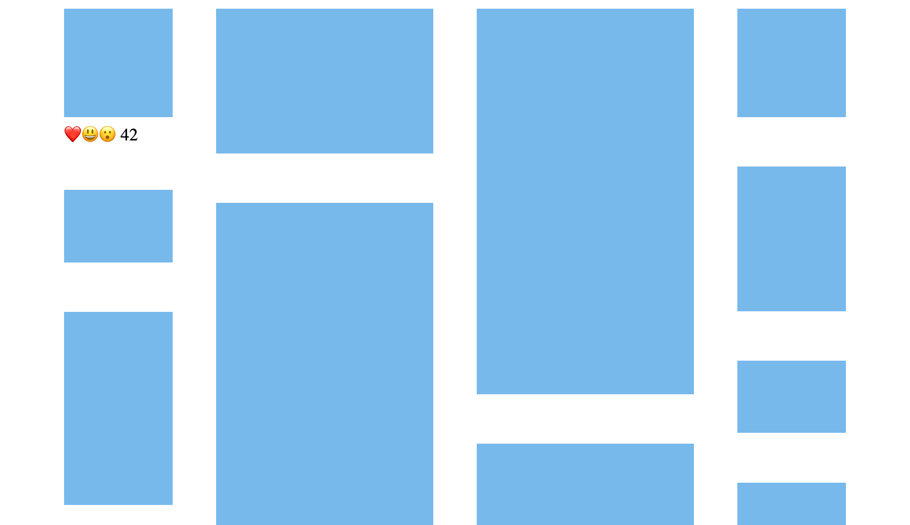
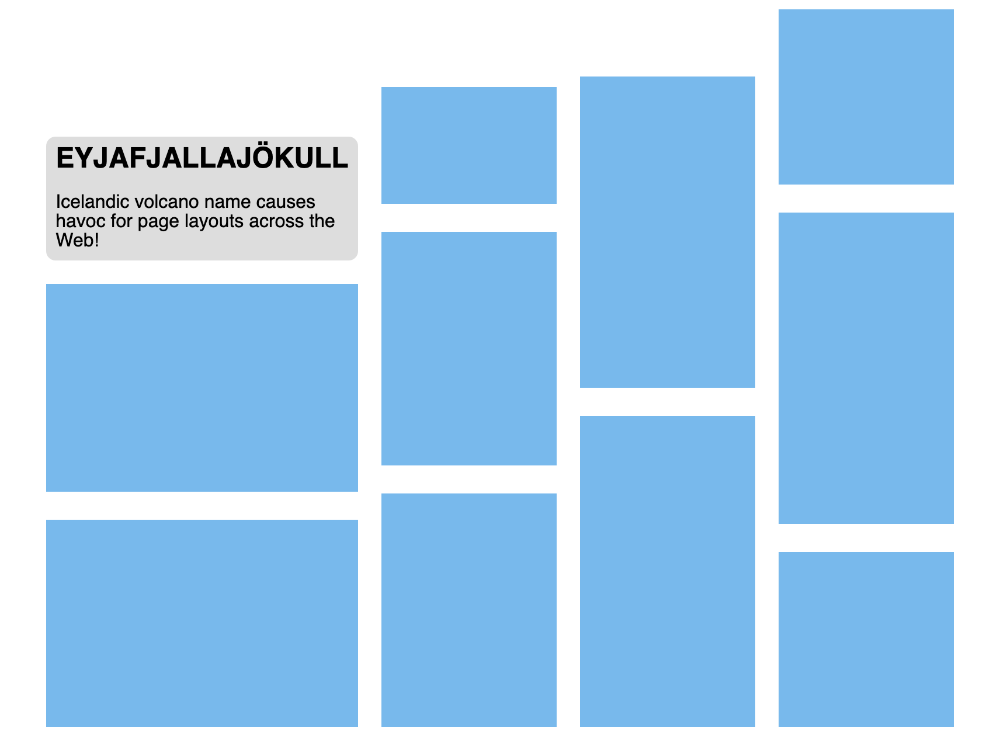

# Masonry Layout

## Problem description

Masonry layout is a common Web design pattern where a number of items — commonly images or short article summaries — are placed one by one into columns, so-called because it resembles stone masonry.  Unlike regular column layout, where items are placed vertically in the first column until they must spill over to the second column, masonry layout selects a column for each new item such that it is generally closer to the top of the layout than items placed later.

The Pinterest search results page exemplifies this layout:


Here, each item has a different height (depending on the content and the width of the column), and inspecting the DOM reveals (as the visual content itself gives no indication of ordering) that each item has been placed into the column with the smallest height so far.

An advantage to using this layout over regular column layout is that the masonry layout container height grows as more items are placed into it, as a balancing multi-column layout would, but the effect for the reader is that scrolling down will naturally lead to "later" items in the layout (that is, those less relevant in the search results).

Achieving this layout without knowing upfront how tall each item will be is not possible without using script.

## Examples demonstrating proposed solution

Our proposed solution is an extension to the CSS Grid model to support the automatic placement of grid items using masonry rules instead of the existing auto-placement algorithm.  Below are some examples to demonstrate.

### Example 1 – Simple masonry layout

This shows how to achieve the Pinterest search results page layout:

```html
<style>
/* masonry layout with items automatically placed in as many 200px columns as will fit */
.results {
  display: grid;
  grid-template-rows: masonry;
  grid-template-columns: repeat(auto-fill, 200px);
  gap: 40px;
  justify-content: center;  /* center columns in the grid container */
}

/* size images to take up their grid column width */
img { width: 100%; }
</style>
<div class="results">
  <div><br>❤️😃😮 42</div>
  <div></div>
  <div></div>
  <div></div>
  ...
</div>
```


By specifying `grid-template-rows: masonry`, we cause items to be placed in the column that has the least content so far.  Columns tracks are created as usual (due to the `repeat(auto-fill, 200px)` value for `grid-template-columns`), but row tracks are not used for the final layout of the grid items; instead each item assigned to a column is positioned just below (including any `gap`) the previous item.

### Example 2 – Spanning columns

Since this is a type of grid layout, we can make items span multiple columns.  Taking the same Pinterest example and making all portrait orientation images span two columns:

```html
...
<div class="results">
  <div><br>❤️😃😮 42</div>
  <div style="grid-column: auto / span 2;"></div>
  <div></div>
  <div></div>
  ...
</div>
```


Here, the `grid-column: auto / span 2` property causes the second item to span two column tracks.  `auto` is used for the starting grid line, allowing the automatic placement by the masonry layout algorithm into the next appropriate column to work.

### Example 3 — Non-uniform column widths

As with regular CSS Grid layout, columns can be assigned different widths:

```html
<style>
.results {
  display: grid;
  grid-template-rows: masonry;
  grid-template-columns: 100px repeat(auto-fill, 200px) 100px;
  gap: 40px;
  justify-content: center;
}
img { width: 100%; }
</style>
<div class="results">
  ...
</div>
```



### Example 4 – Definite placement of items

If we want to ensure an item is placed in a specific column, we can use the regular grid placement properties.  For example, to place the item with the reaction emoji in the final column:

```html
...
<div class="results">
  <div style="grid-column: -2;"><br>❤️😃😮 42</div>
  <div></div>
  <div></div>
  <div></div>
  ...
</div>
```


### Example 5 – Intrinsic size based column widths

Tracks can be sized based on item intrinsic sizes, with some limitations due to masonry automatic placement occurring after track sizing:

```html
<style>
body { font: 16px sans-serif; }
h1 { font-size: 24px; text-transform: uppercase; margin-top: 0; }
img { width: 100%; }

.container {
  display: grid;
  /* auto size the first column; only the first automatically placed item in this
     column's intrinsic size influences the track width */
  grid-template-rows: masonry;
  grid-template-columns: auto repeat(3, 150px);
  gap: 20px;
  justify-content: center;
}

.feature {
  background-color: #ddd;
  border-radius: 8px;
  padding: 8px;
  width: min-content;
}
</style>
<div class="container">
  <div class="feature">
    <h1>Eyjafjallajökull</h1>
    <div>Icelandic volcano name causes havoc for page layouts across the Web!</div>
  </div>
  <div></div>
  <div></div>
  ...
</div>
```


### Example 6 – Aligning items in a column

Since items within each column are not aligned with items in adjacent columns, there is an opportunity to align all of the items vertically in each column independently.  (As opposed to regular grid layout, where only either tracks as a whole, or items within a single grid area, can be aligned.)

```html
<style>
...
.container {
  /* auto size the first column; only the first automatically placed item in this
     column's intrinsic size influences the track width */
  grid-template-rows: masonry;
  grid-template-columns: auto repeat(3, 150px);
  gap: 20px;
  justify-content: center;
  
  /* align items in each column to the bottom of the container */
  align-tracks: end;
}
...
</style>
...
```




## Summary of proposed solution

In the common case (and as shown in all the examples above), items are stacked in the grid columns, without the vertical alignment that comes from items being placed into rows as in regular CSS Grid layout.  The horizontal axis (along which the vertical grid lines are placed) is termed the "grid axis", and the vertical axis (in which items are stacked) is termed the "masonry axis".  At most one axis can use masonry layout.

Syntax:

* a new value `masonry` for `grid-template-columns` and `grid-template-rows` properties, indicating that masonry layout is to be used for the grid container in the specified axis
* new properties `justify-tracks` and `align-tracks` (taking the same values as their `justify-content`/`align-content` cousins), which can be used to align items within a grid axis track
* a new property `masonry-auto-flow`, to control aspects of the masonry layout algorithm

**[For ease of explanation, we assume below that masonry layout is specified for `grid-template-rows`.]**

Conceptually, a grid container using masonry layout only generates a one dimensional grid.  No grid rows are generated.

Grid columns are generated as a result of the usual `grid-template-columns`, `grid-auto-columns`, and item placement properties.

The grid columns are sized by running the standard [grid item placement algorithm](https://drafts.csswg.org/css-grid/#auto-placement-algo) to generate a hypothetical grid, find a placement for each item in this hypothetical grid, and then running the [grid sizing algorithm](https://drafts.csswg.org/css-grid/#algo-overview) on it to compute the column sizes.  Only the intrinsic sizes of the following items are taken into account when sizing the columns:

* items that have a definite placement in the grid axis (e.g. with `grid-column: 3 / span 2`)
* items that have an automatic placement that puts them in the first row
* items that span all columns of the grid

(Since masonry layout places items into columns depending on the filled height of the columns so far, the only items that we know will be in specific columns regardless of layout, and thus can be taken into account when sizing the columns, are these ones.)

Once the grid columns have been created and sized, masonry layout is performed to place each item.  Each grid column keeps track of a running position, initialized to zero, which is used to determine which column (or span of columns) to assign the next item to.  As each subsequent item is placed, the running position for the column (or span of columns) the item is placed in is updated.  `gap` values and margins between items are applied.

The masonry grid item placement is done in `order`-modified document order.

The `masonry-auto-flow` property allows control of aspects of the masonry layout algorithm.  Its initial value is `definite-first pack`, which causes definitely placed items to be handled before automatically placed items (since that is how the regular grid layout placement algorithm works), and for the columns chosen for each item to be based on the smallest running position so far.  Keywords to override these defaults:

* an `ordered` value in place of `definite-first`, which causes items to be placed in their pure `order`-modified document order, rather than selecting definitely placed items first
* a `next` value in place of `pack`, which causes each column in term to be selected, rather than using the running position to choose the shortest one

Finally, we use the value of `align-tracks` to align, distribute, and stretch the items in each column.  This supports a comma separated list of keywords to apply to each grid column, with the last value applying to any remaining columns.  Alignment in the grid axis behaves as in regular grid layout.

## Details

More details, including on sizing the masonry grid container, performing baseline alignment of items, fragmentation, and interaction with subgrid, are in [#4650](https://github.com/w3c/csswg-drafts/issues/4650).

## Prototype

A prototype of this proposal is available in Firefox Nightly, behind a pref.  See [this comment](https://github.com/w3c/csswg-drafts/issues/4650#issuecomment-620864503) for how to enable it.

## Issues

* How do we define a static position for absolutely positioned children of a masonry grid container, and what containing block do we use to align them?

## Why extend CSS Grid?

The reasons we think extending CSS Grid is a reasonable solution, as opposed to creating a wholly new layout model with a new `display` type:

* It suits requirements from existing masonry layouts found on the Web, such as having items that span multiple columns and using gaps between items.
* It avoids needing to duplicate concepts from CSS Grid, which means that it should not only be easier to specify, but it will also be easier for authors to learn if they are already familiar with Grid and Alignment.
* It supports more control than a solution written from scratch likely would, e.g. by getting CSS Grid line name resolution, item placement, complex track sizing functions, and subgrid support for free.
* Supporting masonry layout in developer tools will require much less work, since it's easy to augment existing Grid tools.
* It allows for graceful degradation to a regular grid layout, if written with for example:

```css
grid-template-rows: masonry;              /* ignored if masonry not supported */
grid-template-columns: repeat(4, 100px);  /* applied even if masonry not supported */
```

## Alternative solutions

If the script overhead is acceptable, then there are a number of script libraries and framework plugins that implement masonry layout, the first of which was [Masonry by David DeSandro](https://masonry.desandro.com/).  As with all widely deployed scripted layout solutions, they can only participate in the surrounding page layout in limited, less efficient ways than built-in engine support for a layout model.  Although often this is sufficient.

Houdini Layout provides a script API for authors to correctly hook into the browser's layout engine, so this provides a way to correctly participate in the surrounding page layout.  This comes at the cost of being more complex to write than a simple, resize event or `ResizeObserver` using script.

