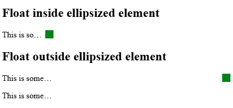

# [css-overflow-4] Middle Truncation

Authors:

- Sebastian Zartner (author of the [original proposal](https://github.com/w3c/csswg-drafts/issues/3937))
- Sharon Lam

## Introduction

Ellipsis in the middle of a text is a common truncation pattern, most useful when the beginning and end of a string matters. It is used commonly in technical identifiers to distinguish similar items, such as file names, URLs, file paths, and API keys.

**Example:** A file manager truncating long filenames:

| Filename                   | End truncation    | Middle truncation    |
| -------------------------- | ----------------- | -------------------- |
| `thesis-report-final.xlsx` | `thesis-report-…` | `thesis-…final.xlsx` |
| `thesis-report-draft.xlsx` | `thesis-report-…` | `thesis-…draft.xlsx` |

End truncation makes the two files appear identical; middle truncation preserves both ends, keeping the distinguishing suffix visible.

This document illustrates an update to the existing `text-overflow` spec to accommodate overflow handling via middle truncation.

## Goals

- Provide an ergonomic, backward-compatible interface to apply middle truncation to overflowing text.
- Allow authors to change the position of the default middle truncation overflow marker.
- Make the syntax flexible enough, so it could be used on block containers with multiple lines in the future, e.g. in conjunction with `line-clamp` and its longhands.

## Non-goals

- Describe how middle truncation works block containers, i.e. `line-clamp` and its longhands.
- Describe how middle truncation should be implemented by user agents or platforms.

## Current solutions

Many have attempted to address this either by applying `text-overflow` on split text across two DOM elements, or by using `ResizeObserver()` to detect overflow and format strings with JavaScript. However, these workarounds pose usability, accessibility, and performance concerns. Such problems are especially amplified in data-heavy displays like tables.

One notable concern is the inability to copy and paste the non-truncated version of the clipped text, unlike text truncated via CSS's `text-overflow: ellipsis`, where the underlying text node is untouched and copying yields the original string. Implementations can also overlook providing an accessible name (e.g. via `aria-label`) for the truncated element, resulting in a broken assistive technology experience. Additionally, solutions relying on `ResizeObserver()` must know the available inline space before computing the truncated string, requiring an extra rendering cycle and continuous listening for container size changes, which adds further performance overhead.

### Browsers

Browser engines currently already use middle truncation for selected file names in the `<input type="file">` element.

Chrome:


Safari:


Firefox:


## Proposed solution

Extend the existing `text-overflow` shorthand to handle a `middle` position marker,
with an adjustable overflow marker position expressed by a `<length-percentage>`.
Note that middle truncation is made mutually exclusive with the existing start and end ellipsis.
It also excludes the `clip` keyword for the middle truncation case, as clipping the middle of a string without a visible marker results in bad user experience.
And it introduces (optional) explicit keywords for the start and end positions to avoid ambiguity when the overflow marker is specified.

### Syntax

```ebnf
text-overflow = [ [ clip | <overflow-marker> ] && [ start | end ]? ]{1,2}
              | [ <overflow-marker> && [ middle | <length-percentage [0,∞]> ] ];
<overflow-marker> = [ ellipsis | <string> | fade | <fade()> ];
```

```css
/* middle ellipsis */
text-overflow: ellipsis middle;

/* middle ellipsis with offset */
text-overflow: ellipsis 30%;
text-overflow: ellipsis 3ch;
text-overflow: ellipsis calc(100% - 4ch);

/* start and end with marker */
text-overflow: clip start ellipsis end;
text-overflow: clip ellipsis;

/* only end */
text-overflow: ellipsis;
text-overflow: ellipsis end;

/* only start */
text-overflow: ellipsis start;

/* invalid entry */
text-overflow: clip start ellipsis start;
text-overflow: fade end clip end;
text-overflow: middle;

/* Existing start and end syntax remains accepted */
text-overflow: clip;
text-overflow: ellipsis ellipsis;
text-overflow: ellipsis " [..]";
```

### Positioning

`<length-percentage>` specifies the overflow marker position measured against the available inline space within a line box, with the offset starting from the line-end edge. Such inline space excludes any portion that overflows out of the block container. Values less than `0` are clamped to `0`. Values greater than the inline space are clamped to the extent of the space.

Percentages resolve against the available inline space subtracting the width of the overflow marker, aligning with the behavior of `background-position`. This means, a value of 0% aligns the end-edge of the overflow marker with the line-end edge, while a value of 100% aligns its start-edge with the line-start edge. A value of 50% positions the overflow marker in the middle of the available inline space, with its center aligned with the center of the space.
This ensures that the overflow marker is always visible and the behavior is predictable.

The keyword `middle` is generally equivalent to `50%`.
Though user agents are allowed to position the overflow marker intelligently, so that important parts of the text stay visible as far as possible. Examples for that might be the file extension in a file path or the domain and the final non-path part of a URL.

Below are some basic examples of offset calculation:

```
// ruler for a 40ch wide mono-space container

// ellipsis middle / ellipsis 50%
├─────19 chars────┤1├─────20 chars─────┤
The quick brown fox…og by the river bank

// ellipsis 30%
├─────────27 chars────────┤1├─12 chars─┤
The quick brown fox jumps o…e river bank

// ellipsis 3ch
├─────────────36 chars─────────────┤1├3┤
The quick brown fox jumps over the l…ank

// ellipsis 100%
1├───────────────39 chars──────────────┤
…mps over the lazy dog by the river bank

// ellipsis calc(100% - 4ch)
├─4┤1├───────────36 chars──────────────┤
The …over the lazy dog by the river bank

// ellipsis 0%
├───────────────39 chars──────────────┤1
The quick brown fox jumps over the lazy…

// Custom marker " [..]"
├────17 chars───┤├─5─┤├─────18 chars───┤
The quick brown f [..] by the river bank
```

#### With invalid entry

While the syntax permits it, repeated declaration of `start` or `end` markers will be regarded the same as not specifying `text-overflow`.

```css
text-overflow: clip start ellipsis start;
text-overflow: fade end clip end;
```

 The syntax might be changed to disallow these invalid combinations.

## Layout behavior

### Scrolling

Like end- and start and end truncation, middle truncation is a purely visual effect that has no influence on the layout. This is done by making the end portion of the text visually fixed, while the UA may make the start portion scrollable to reveal different parts of the hidden content, or alternatively, the entire line may remain non-scrollable.

#### Example: Scrollable middle truncation

Consider a file path that is truncated in the middle with a scrollable start portion:

```html
<div class="file-path-container">
  <p class="truncate-middle">
    /home/user/documents/projects/important-project-name/subfolder/very-long-file-name.txt
  </p>
</div>
```

```css
.file-path-container {
  width: 50ch;
  font-family: monospace;
  overflow: hidden;
}

.truncate-middle {
  white-space: nowrap;
  overflow: hidden;
  text-overflow: ellipsis middle;
}
```

**Visual result:**
```
/home/user/documents/…very-long-file-name.txt
```

If the user agent supports scrolling to reveal truncated content, the start portion of the path could be scrolled horizontally to reveal:

```
/projects/important-project-name/subfolder…very-long-file-name.txt
```

while keeping the end portion (filename) fixed for reference.

### Behaviors unchanged from `text-overflow: ellipsis`

Middle truncation does not introduce new behavior for the following.

- **Intrinsic sizes.** Middle truncation doesn't affect intrinsic sizes.
- **Margins, display.** Margins and display values follow the same rules as for `text-overflow: ellipsis`.

### With floats

There are two scenarios to consider: a float that is a sibling of the truncated element, and a float that is a child of it. In both, existing browsers leave the float's position unchanged, because `text-overflow` elides only a line box's inline-level content and a float is out-of-flow. When the float is outside, it is not part of the truncated element. When the float is inside, the element contains it and the float reduces the line's available inline size, but the float is never truncated.



```html
<h2>Float inside ellipsized element</h2>
<div class="ellipsized">
  <div class="float"></div>
  This is some sentence that is ellipsized.
</div>
<h2>Float outside ellipsized element</h2>
<div class="container">
  <div class="float"></div>
  <p class="ellipsized">This is some sentence that is ellipsized.</p>
  <p class="ellipsized">This is some sentence that is ellipsized.</p>
</div>
```

```css
.ellipsized {
  overflow: hidden;
  text-overflow: ellipsis;
  white-space: nowrap;
  width: 100px;
}

.float {
  width: 1em;
  height: 1em;
  float: right;
  background-color: green;
}
```

Given this behavior, middle truncation should interact with floats as follows.

#### Float inside the truncated element

The float keeps its position and is not truncated. The middle ellipsis marker is placed within the inline content, which fills the available inline size reduced by the float.

```html
<div class="truncated">
  <div class="float"></div>
  This is some sentence that is truncated in the middle.
</div>
```

```css
.truncated {
  overflow: hidden;
  text-overflow: ellipsis middle;
  white-space: nowrap;
  width: 100px;
}

.float {
  width: 1em;
  height: 1em;
  float: right;
  background-color: green;
}
```

This is an illustration of how ellipsizing doesn't affect float, where the pound signs "##" represent the float block.
```
|------ 100px wide -----|
+-----------------------+
| This is...middle.  ## |
+-----------------------+
```

#### Float outside the truncated element

Same as today's start and end truncation. The float is a sibling outside the truncated element, so truncation has no effect on its position.

### With Inline-block

### With small line box

When the available inline space within linebox becomes to small for the prefix, overflow marker, and suffix, the priority of elements to display should be the following:

1. Overflow marker
2. Prefix
3. Suffix

Below is an example showing a truncated with middle ellipsis as its container shrinks:

```
Lorem Ipsum is simply dummy text of the printing and typesetting industry.
Lorem Ipsum …industry.
Lorem…
…
```

## Interaction with bidirectional text

To maintain intuitiveness of offset calculation, we should use line-end position as the reference point for bidi text as well. Below are examples demonstrating why this design decision is ergonomic.

Example 1 and 2 show the base cases of LTR and RTL paragraphs with occasional strings of the opposite direction. Example 3 is a list of bidi filenames in LTR direction, showing how a container-relative reference point behaves when the text inside runs the other way.

### Example 1: LTR paragraph with RTL content

```html
<p>
  The title is
  <cite dir="rtl">AN INTRODUCTION TO <span dir="ltr">c++</span></cite>
  in arabic.
</p>
```

The original sentence and the truncated text are:

> <div dir="ltr">The title is مدخل إلى C++ in Arabic.</div>
> <div dir="ltr">The title …Arabic.<div>

### Example 2: RTL paragraph with LTR content

```html
<p dir="rtl">W3C מעביר את שירותי הארחה באירופה ל - ERCIM.</p>
```

The original sentence and the truncated text are:

> <div dir="rtl">W3C מעביר את שירותי הארחה באירופה ל - ERCIM.</div>
> <div dir="rtl">W3C מעביר… באירופה ל - ERCIM.</div>

### Example 3: Technical identifiers like filenames

Filenames frequently mix scripts but are typically displayed in `ltr` direction for consistency with file system conventions, even when they contain RTL characters. Users can override the direction with the `dir` attribute on the block container when needed.

| Filename                                            | Middle Truncated                    | Notes                                                |
| --------------------------------------------------- | ----------------------------------- | ---------------------------------------------------- |
| `report_تقرير_final.pdf`                            | `report_…l.pdf`                     | LTR-wrapped RTL in the middle                        |
| <div dir="rtl">`تقرير_السنوي.docx`</div>            | <div dir="rtl">`تقرير_….docx`</div> | <div dir="ltr">All-RTL name with LTR extension</div> |
| <div dir="ltr">`تقرير_السنوي.docx`</div>            | <div dir="ltr">`تقرير_….docx`</div> | All-RTL name with LTR extension in a LTR container   |
| <div dir="ltr">`تقرير_2024_annual_report.pdf`</div> | `2024….t.pdf`                       | RTL, Western digits, and LTR                         |
| `report_تقرير.pdf`                                  | `report….pdf`                       | LTR start, RTL middle, LTR extension                 |
| `file_name.תקציר`                                   | `file_…תקציר`                       | Latin name with RTL extension (extension is RTL)     |
| `draft(تقرير).docx`                                 | `draft(….docx`                      | Neutral parentheses around an RTL                    |

Each of these strings exercises a different combination of LTR, RTL, and neutral (punctuation, digit) characters. In every row the visible tail is the end of the string in logical order, because the offset counts back from the line-end edge. That holds even where the tail is drawn on the far side of the line from where a purely visual reading would put it, as in the all-RTL name shown in an LTR container.

### Browsers

As browsers already have support for middle truncation in `<input type="file">` elements, they need to handle bidirectional file names. Here is a simple example of how they truncate bidirectional file names.

Chrome:


Safari:


Firefox:


## Further notes

`text-overflow` is kept applying to block containers only for the time being.

## Open questions
* Enforce creation of a BFC?

## Future work

### With `line-clamp`

## References & acknowledgements

Many thanks for valuable feedback and advice from:

- Florian Rivoal
- Andreu Botella
- Emilio Cobos Álvarez