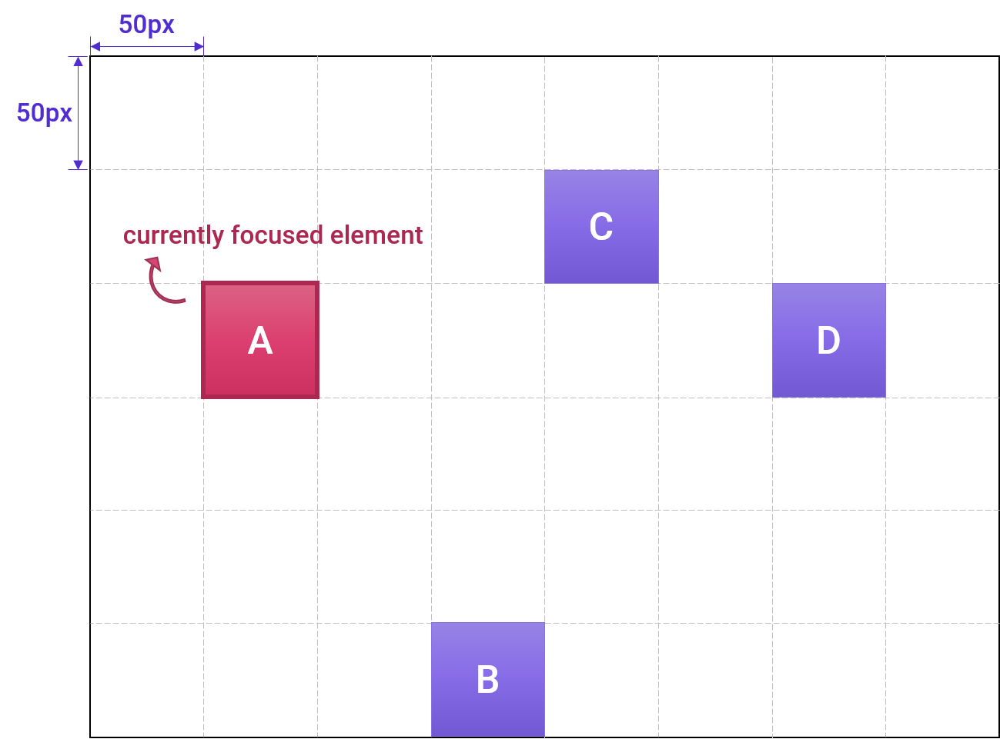

# Proposed APIs for the spatial navigation
<b>NOTE: This is an unofficial proposal draft.</b>

To support the spatial navigation in the Web, we need to develop several standard APIs. The APIs seem to be discussed with the suitable working groups in W3C (mainly in CSS WG). In this explainer page, the latest status of the spatial navigation would be summarized so that the overall progress could be tracked at a glance.

## API for enabling the spatial navigation mode
It makes author set the spatial navigation mode. The following APIs could be considered for the possibilities to support the feature:

#### * CSS property
- If the proposed property below is applied to the element, the DOM subtree rooted at the element can be managed by the spatial navigation.
```css
// CSS property
arrow-key-behavior: auto | navigation | scroll
```
- auto: The arrow keys work as the UA-defined manner.
- navigation: The arrow keys work for the spatial navigation.
- scroll: The arrow keys work for scrolling.

#### * DOM method (JS)
```javascript
// JavaScript
setSpatialNavigationEnabled(boolean)
```
- If the parameter is `true`, the spatial navigation mode is enabled.
- Otherwise, the arrow keys work as the UA-defined manner.
  
## Overriding methods on top of the heuristic algorithm
Developers can customize the spatial navigation with CSS properties by overriding the heuristic spatial navigation.

### Current Approach
There were the properties about the directional focus navigation in the CSS Basic User Interface Module Level 4.
- [nav-up/right/down/left properties (CSSUI4)](https://drafts.csswg.org/css-ui-4/#nav-dir)
```css
// nav-right, nav-down, nav-left have same values as nav-up below
nav-up: auto | <id> [ current | root | <target-name> ]?
```  
- The properties determine which element to navigate the focus in response to pressing the arrow keys. This is applied to each element which can be focused.
- Note
  - Able to use even if the heuristic spatial navigation is not supported.
  - Override the heuristic spatial navigation if it is supported.
- Issues
  - Why CSS properties instead of HTML attributes (like `tabindex` as a DOM attribute)?
  - How does the feature interact with the existing definition of focus and what is or isn't focusable?
  - How can the feature be made to be composable?
    - E.g. in a world of custom elements and frameworks like polymer, how can you reason about spatial navigation without having global knowledge of the whole page?
    - E.g. could we instead make the properties define local spatial navigation (e.g. between components) while allowing components to determine navigation behavior inside of themselves?


### Proposal
The following properties are proposed to provide ways for customization of the spatial navigation.

#### `nav-rule` property (CSSUI4)
- This property can customize the spatial navigation of the group of elements in response to pressing the arrow keys.
```css
nav-rule: auto | projection | direction | nearest
```
- The meaning of `nav-rule` values
  - auto: The UA automatically determines which element to navigate the focus.
  - projection: Moves the focus to the first element encountered when projecting the edge of the currently focused element to the edge of the applied element in the direction of navigation.
  - direction : Moves the focus to the first element encountered when projecting the edge of the applied element from the currently focused element in the direction of navigation.
  - nearest: Moves the focus to the closest element based on the shortest 2D distance and the distance is measured depending on the center of each element.
- Note  
  - Able to use if the heuristic spatial navigation is enabled by default.
  - Applied to the containing block, so all focusable elements in the DOM subtree rooted at the applied element follow the specified rule for the spatial navigation.
  - Overridden by nav-left/right/top/bottom properties.
  - Override the Heuristic Spatial Navigation if it is supported.
- If the `nav-rule` property is applied to the element E, the focus moves in the DOM subtree rooted at E in the scrollable area created by E as below.    
    ```html
    // HTML
    <div id="E">
        <div id="A" tabindex="1" style="top: 100px; left: 50px;">A</div>
        <div id="B" tabindex="1" style="top: 250px; left: 150px;">B</div>
        <div id="C" tabindex="1" style="top: 50px; left: 200px;">C</div>
        <div id="D" tabindex="1" style="top: 100px; left: 300px;">D</div>
    </div>
    ```
    ```css
    // CSS
    #E { width: 400px; height: 300px; }
    #A, #B, #C, #D { width: 50px; height: 50px; }
    ```
    
    
    - If the currently focused element is A and there is input from the :arrow_right: (right-arrow key),
      - If `nav-rule: projection` is applied to the element E, the focus moves to D.
      - If `nav-rule: direction` is applied to the element E, the focus moves to B.
      - Otherwise `nav-rule: nearest` is applied to the element E, the focus moves to C.
      
#### `nav-loop` property (CSSUI4)
- This property enables the ability about the focus looping (moving the focus when the focus reaches the end of the page).
- The sequential focus navigation by tab key supports the focus looping, but the heuristic spatial navigation implemented in blink does not support it.
- It would be useful to have the focus looping feature in the spatial navigation, especially for the single page with long-scroll. 
```css
nav-loop: auto | no-repeat | repeat
```
- The meaning of `nav-loop` values
  - auto: The UA automatically determines where to move the focus when the focus reaches the end of the page.
  - no-repeat: Disables the focus looping
  - repeat: Enables the focus looping

- If `nav-loop: repeat` is applied to the element E, the DOM subtree rooted at E is eligible to participate in the focus looping for any scrollable area created by E.
  - Let the element A is the first child node, and the element Z is the last child node in the DOM subtree rooted at E.
  - If the currently focused element is Z and there is an input from the :arrow_down: (down-arrow key), the focus is moved to A.

## Demo
- [Calendar App using the proposed spatial navigation features](https://lgeweb.github.io/spatial-navigation/demo/)
- [Test cases for the heuristic spatial navigation](https://lgeweb.github.io/spatial-navigation/demo/heuristic/heuristic_testcases)

## Future work
Solving unreachability, saving last focus, group concept, aligning with scrolling, pointer/key mode selection
