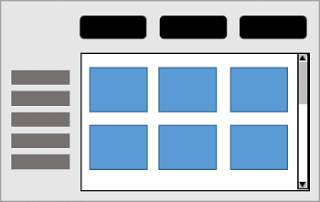
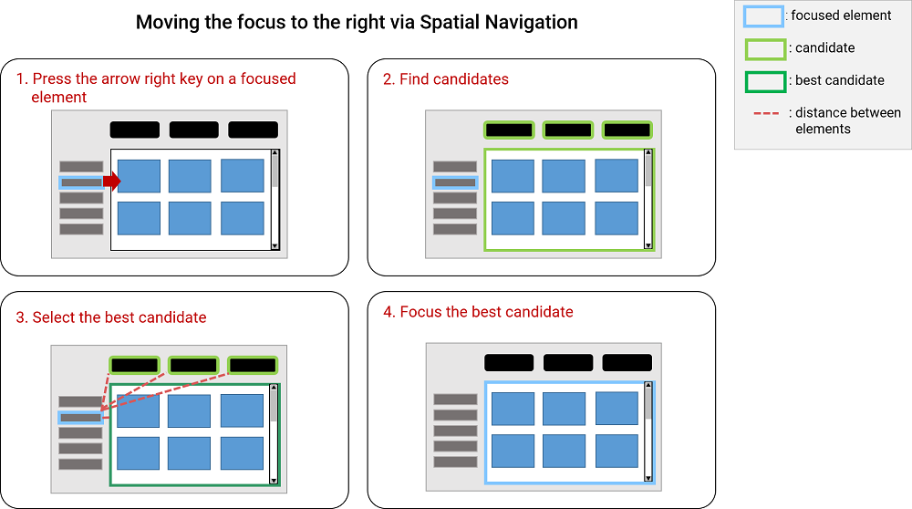

# Proposed Model and APIs for spatial navigation
## Introduction

Historically, most browsers have not offered features to let users move the focus directionally.
Some, such as TV browsers, have enabled users to move the focus using the arrow keys out of necessity,
since no other input mechanism is available on a typical TV remote control.

Others, have enabled different key combinations to control spatial navigation,
such as pressing the <code class=key>Shift</code> key together with arrow keys.

This ability to move around the page directionally is called <strong>spatial navigation</strong>
(or <strong>spatnav</strong> for short).

## What are we going to solve?

### Supporting spatial navigation on a web page by default

- **Getting devices whose only or primary means of navigation is the D-pad**

  Devices like TV, InVehicleInfotainment, game console mainly use the D-pad for navigating focus directionally.
  More rare today, but possibly increasingly going forward, input mechanisms such as voice command, hand gesture, eye tracking can be used for navigation.

- **Making life better for users of desktop browsers who use the keyboard to navigate**

   For non-sighted users, navigating in document order tends to be appropriate,
   and spatial navigation may not be in high demand.
   However users with partial visual impairment which may be corrected with glasses,
   or with motor difficulties
   may find using the keyboard to be much preferable to using the mouse,
   without necessarily being interested in the navigation being sequential.
   As such people are aware of the spatial organization of elements in the page,
   being required to go through elements one by one in document order
   when directional instructions would be much more direct is frustrating

- **Using the simple and predictable spatial navigation**

  If spatial navigation becomes default in the browser, it will be easier for authors to implement a web page using this feature without having to write custom navigation code.
  Also it ensures the predictable result and reasonable performance of spatial navigation rather than using frameworks which are quite heavy and slow and don't consider all the diversity of use cases.

### Allowing authors to override the default spatial navigation behavior

Spatial navigation is intended to identify the most-likely desired element in the direction of the key press.
But "most-likely desired" can depend on the situation.
For sequential navigation, document order is a well defined concept,
since the traversal order is deterministic and non ambiguous.

With Spatial navigation, there is no such easy definition.
If there are multiple elements in the requested direction,
should we pick the closest one in that general direction,
or should we prefer one that is maybe a little further but better aligned with the direction's axis.
What does "closest" mean anyway? Is it the euclidean distance?
Is it from the center of the elements or from their closet edge?
Does that depend if the edges are visible?
If so, is there a difference between edges are made visible with a border vs a background color for the whole element?
How much contrast at the edges is needed to prefer measuring the distance to the edges.
If two elements are at equal distance,
should we prefer one that is visually more noticeable,
possibly through high contrast, bigger fonts, or animations?
If two elements are at equal distance and equally noticeable,
should we prefer the one to the left or to the right?
Is that reversed in Arabic?
Effectively, the entire field of graphical design
relates to guiding the attention of the viewer,
and would need to be taken into account.

The solution we propose has relatively simple default behavior that performs well in most cases.
But since we know it cannot be right for all cases,
we also introduce overriding APIs to let authors
tune and tweak the default spatial navigation behavior to best match their page.

### Motivating Use cases
#### Moving focus to the desired element quickly
How are we going to look through all elements quickly on a web page?
There are use cases such as:
- **Using a grid-like layout**

  The figure below represents a photo gallery arranged in a grid layout.

  

  If the user presses the <code class=key>Tab</code> key to move focus,
  they need to press the key many times to reach the desired element.
  Also, the grid layout may arrange the layout of elements independently of their source order.
  Therefore sequential navigation using the <code class=key>Tab</code> key makes focus navigation unpredictable.
  In contrast, <a>spatial navigation</a> moves the focus among focusable elements
  depending on their position
  allowing it to address problems encountered with sequential navigation.

- **Having too many focusable elements**

  Sometimes the user doesn't want to navigate all focusable elements on a web page.
  If a shorter path to the desired target can be visually identified,
  <a>spatial navigation</a> can be used to get there faster.

  Also, using the overriding APIs, the page author can offer the user ways
  to filter out some the focusable elements if they are not relevant.
  For example, if the user just wants to move focus to <code>&lt;input></code> elements,
  limiting spatial navigation to only focusing these can be achieved using the APIs.

#### Moving focus just as authors intended

How do we ensure the correct element is focused?
There are some use cases which need interrupting the default spatial navigation and custom handling if necessary.

- **Navigating to the offscreen element within scrollport directly**

  There may be a desire about moving the focus to a hidden element while the user is using spatial navigation on a scrollable area. The default behavior of pressing the arrow key is scrolling if there isn’t any visible element in the scrollport. When the hidden element comes into view, then it can gain the focus. But with proposing overriding APIs, the author can interrupt the default behavior and move the focus directly to it without scrolling first.

## How are we going to solve?

The [specification of spatial navigation](https://wicg.github.io/spatial-navigation/) introduces the processing model for spatial navigation which explains the default spatial navigation behavior.
Also, it proposes Javascript APIs, Javascript Events, and a CSS property
to extend how spatial navigation work.

### Activating Spatial Navigation
The spec supposes that User Agents decide to activate spatial navigation.
On devices which do not have any pointing input device,
and especially on devices such as TVs which also lack a <code>Tab</code> key to control
<a herf="https://html.spec.whatwg.org/multipage/interaction.html#sequential-focus-navigation">sequential focus navigation</a>,
User Agents should make spatial navigation active.

We deliberately do not define which keys or key combination are meant to trigger spatnav,
nor whether it is on by default or not.
These are choices that are best left to the user and the User Agent.
This is discussed in greater detail in <a href="https://github.com/WICG/spatial-navigation/issues/35#issuecomment-371702434">Issue 35</a>
where we decided to switch to that model, from one where the author was in charge.

### Processing model

When spatial navigation is active,
pressing an arrow key will either
move the focus from its current location to a new focusable item in the direction requested,
or scroll if there is no appropriate item.

More specifically,
the User Agent will first search for visible and focusable items
in the direction indicated
within the current [spatial navigation focus container](https://wicg.github.io/spatial-navigation/#spatial-navigation-focus-container)
(by default the root element, scrollable elements, and iframes,
but other elements can be made into spatial navigation focus containers
using the `spatial-navigation-contain` property).

If it finds any, it will pick the best one for that direction,
and move the focus there.

If it does not, it will scroll the spatial navigation focus container in the requested direction
instead of moving focus.
Doing so may uncover focusable elements
which would then be eligible targets to move the focus to
next time spatial navigation in the same direction is requested.

If the spatial navigation focus container cannot be scrolled,
either because it is not a scrollable element
or because it is already scrolled to the maximum in that direction,
the User Agent will select the next spatial navigation focus container up the ancestry chain,
and repeat the process of
looking for eligible focus targets,
selecting the best one if there's any,
scrolling if not,
going up the ancestry chain if it cannot scroll,
until it has either moved focus,
scrolled,
or reached the root.

Additionally, when the user has focused a scroll container which contains focusable elements,
the user may move the focus to the nested elements by pressing arrow keys.
The focus will move to the element which is the closest from the edge of the scroll container in the direction of navigation.

The example below shows the simplest flow of spatial navigation when the user presses the right arrow key.



The detailed behavior is described in the [Processing Model](https://wicg.github.io/spatial-navigation/#processing-model).

### Overriding the heuristic algorithm
Authors may want to customize the spatial navigation by overriding the heuristic spatial navigation.

Following the principles of [The Extensible Web Manifesto](https://github.com/extensibleweb/manifesto),
the specification exposes Javascript APIs and Events that enable authors to interact with, and if necessary, override the behavior of spatial navigation.

#### JS APIs

* getSpatnavContainer()
  - Returns the spatial navigation focus container of an element.

* focusableAreas()
  - Returns all focusable elements within a spatial navigation focus container.

* spatNavSearch()
  - Runs the spatial navigation step and returns the best candidate which will gain the focus.

#### Navigation Events

While searching for the appropriate response to the spatial navigation request,
the User Agent will fires events.
These enable authors to prevent the upcoming action
(by calling `preventDefault()`),
and if desired to provide an alternate action,
such as using calling the `focus()` method on a different
element of the author's choosing.

* navbeforefocus
  - Occurs before spatial or sequential navigation changes the focus.

* navbeforescroll
  - Occurs before spatial navigation triggers scrolling.

* navnotarget
  - Occurs before going up the tree to search candidates in the nearest ancestor spatial navigation focus container when spatial navigation has failed to find any candidate within the current spatial navigation focus container.

#### Example
The following code changes the behavior of spatial navigation from scrolling when there is no focusable element visible, to jumping to focusable elements even when they are not visible.
```js
document.addEventListener("navbeforescroll", function(e) {
    var container = e.relatedTarget;
    var areas = container.focusableAreas({ mode: "all" });

    if (areas.length == 0)) { return; }

    e.preventDefault();
    var t = e.target.spatNavSearch({
        dir: e.dir,
        candidates: areas
    });
    t.focus();
});
```

## FAQ

### Why do we need a `spatial-navigation-contain` property? Is it not enough to placing the focusables next to each other to create a group? What use cases do you see for this property?

First, we needed to define a container concept anyway (the blink implementation uses "ScrollableArea or Document"),
to define the rest of the logic.
Then, based on that, pretty much nothing changes in the specification
if we allow users to turn other elements into containers as well,
so we thought it was an easy addition.
It could be removed for now,
as it would be easy to add back later without breaking compatibility,
but was included because we think there is a justification / use case:

Take for example something like a TV program schedule, or a calendar:
it will have a grid of elements representing TV shows or calendar entries,
and some UI buttons around it.
Here's a simplified demo:
http://output.jsbin.com/cuyasob

In this case, the grid is quite sparse,
so if you try to move down from "Foo",
you will end up on "Next Week",
as it is objectively closer in the down direction.
Same for going down from "Bar" and ending up on "Previous Week".

This may be ok,
but quite possibly the author wants to provide a different UX,
where once you are inside the program grid, you mostly want to move inside the grid
(because you are navigating your calendar, so things around it don't matter as much).
If you turn `spatial-navigation-contain: contain` on the table, you get that.
You can still escape it,
for example by going right from "Foo".
Since there is nothing in the grid that is to the right,
you'll go to "Next week",
but if you go down from "Foo" there is something inside the grid,
so it will go there without considering things that are outside.

You could achieve the same effect by wrapping the table in a div
and using the overflow property on the div to make it scrollable,
but that has side effects you probably do not want.

### Maybe authors could create "spatnav containers" with JavaScript instead? Could they listen for spat nav events to cancel (=preventDefault) the navigation? Such an event could give authors even more freedom: they might wanna grab the event and manually put focus somewhere else (to override the spatnav's default choice). Would such event allow authors to "patch" the default algorithm in a more flexible way?

Yes, they absolutely could.
We have prepared the spec with an event model that lets js authors take control,
and override the default spatnav also to do anything they like.
That could indeed be used to manually create spatial navigation containers other than documents or scrollers.

We had various idea for other controls to influence what gets the focus,
(e.g. looping when you reach an edge, picking a different heuristic...),
and we decided to leave these out because they could indeed be left to JS
and be added later with declarative syntax if there was strong demand.

However, we still included this property, because:
1. This is trivial to add to the spec (and presumably, to implementations as well), since the concept of looking for a container and searching for focusable things inside it is built-in into the spatnav logic, and we're merely exposing a hook to add additional containers
2. Recreating that logic in JS if you're fine with everything else could be quite fiddly
3. It seems like a fairly basic need

### How can we know whether an element is visible or not?
Processing model of spatial navigation finds candidates among visible and focusable elements. If an element is obscured by some other element (overlapping for example), should it be automatically excluded from candidates? Or should we rely on authors using <code>tabindex=-1</code> or the <code>inert</code> attribute?

We initially wanted to make it automatic for limiting the number of things authors have to worry about and can get wrong. But feedback from multiple browser vendors we discussed with in the CSS WG led us to remove that, and make it more similar to sequential navigation.
[(See the relevant discussion on Github)](https://github.com/WICG/spatial-navigation/issues/29)

The primary concern was that this involved a particularly expensive form of hit testing that is not used anywhere else on the platform. The secondary reason was that people already need to get the same thing right for sequential navigation, so reinforcing the message was judged useful.

### How can we move the focus inside a spatnav container?
There is possible to have nested focusable elements in a web page. The most typical case for this is an ordinary focusable element (button, link, etc) is inside a scroller, as the scroller is also focusable.
If the currently focused element is the scroller, how can we reach the element inside the scroller with key pressing?

We have considered what would be simpler and more natural to explain and implement the spatial navigation behavior. As a result, the current spec describes this like:
- If the scroller has visible focusable descendants, pressing the arrow key moves the focus inside it and focuses one of them.
- Otherwise, pressing the arrow key works for scrolling it.

But there are two alternatives:
- Let the enter key moves the focus to its focusable child.

  [(See the relevant discussion on Github)]( https://github.com/WICG/spatial-navigation/issues/15)

- Delegate focus inside it without pressing any key, then focus the innermost element or focus the scroll.

  [(See the relevant discussion on Github)]( https://github.com/WICG/spatial-navigation/issues/40)

The approach we have chosen seems more inline with how existing implementations behave,
simpler and therefore easier to understand,
and authors can switch to the other approaches using the APIs.

## Demo
- [Blog using the spatial navigation polyfill](https://wicg.github.io/spatial-navigation/demo/blog/)

- [Samples using the spatial navigation polyfill](https://wicg.github.io/spatial-navigation/sample/)

- [Samples for testing the implementation in Blink](https://wicg.github.io/spatial-navigation/blink_impl/heuristic_default_move.html)

  ***Note***: Samples work best in the latest Chrome with the experimental web platform features enabled (--enable-spatial-navigation flag) otherwise they won't work.
