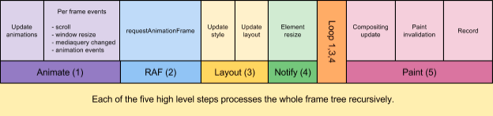

#### Terminology
Component: a self-contained bundle of HTML, CSS, and JS.

## Why is ResizeObserver needed?

Responsive Web Apps adjust their content to viewport size.
This is often accomplished with CSS and media queries.
Javascript is used when CSS is not expressive enough.
Javascript DOM manipulation stays in sync with viewport size by listening to `window.resize` event.

Responsive Web Apps can be built with components.
These components need to be responsive too.
Unfortunately, Web Platform currently does not provide a way for components to keep track of their size.

There is no component counterpart to CSS media queries.
Attempts to design such were unsuccessful due to their [inability to deal](http://www.xanthir.com/b4PR0) with circular references.

There is no component counterpart to `window.resize` event either.
ResizeObserver wants to be that counterpart.

ResizeObserver is needed to give components way to respond to changes in size.

As Responsive Web Apps grow in popularity, so will the need for responsive components.

## Current workarounds

There is no way to replicate ResizeObserver functionality on today's Web Platform.

Some apps implement homemade resize notification framework (ex: Polymer).
This approach is error-prone, hard to maintain, and requires every component to implement the homemade method.

Others use [clever hacks](https://github.com/wnr/element-resize-detector) to approximate resize event.
The best hacks all use a similar absolute child trick: insert an absolutely-positioned child into the component,
and craft the child in such a way that it emits a scroll event, or a window.resize when parent's size changes.
The absolute child method will not work in ShadowDOM, or frameworks such as React.

None of these approaches are desirable.
They fail in correctness, code complexity, and performance.

## Proposed API

The proposed API is an observer-style API. It is modeled after [other](https://www.w3.org/TR/dom/#mutation-observers) DOM [observers](https://github.com/WICG/IntersectionObserver/blob/master/explainer.md).

Here is an example of using ResizeObserver to draw an ellipse inside canvas.
```html
<canvas style="width:10%;height:10%"></canvas>
<canvas style="width:20%;height:20%"></canvas>
```
```javascript
    function drawEllipse(entry) {
        let ctx = entry.target.getContext('2d');
        let rx = Math.floor(entry.contentRect.width / 2);
        let ry = Math.floor(entry.contentRect.height / 2);
        ctx.beginPath();
        ctx.clearRect(0,0, entry.contentRect.width,entry.contentRect.height);
        ctx.ellipse(rx, ry, rx, ry, 0, 0, 2 * Math.PI);
        ctx.stroke();
    }
    // ResizeObserver delegates action to Element's handleResize method
    let ro = new ResizeObserver( entries => {
        for (let entry of entries) {
            if (entry.target.handleResize)
                entry.target.handleResize(entry);
        }
    });
    // Set up observations
    var canvases = document.querySelectorAll('canvas');
    for (let canvas of canvases) {
        canvas.handleResize = drawEllipse;
        ro.observe(canvas);
    }
```
### Usage examples

Knowing when Element's size has changed can be used to solve other common
webdev problems. Fully functional examples are available on [github](https://rawgit.com/WICG/ResizeObserver/master/examples/index.html).

#### Example: `iframe` resizing to content size.

iframes can detect when their size has changed, and notify the parent window.

```javascript
    let ro = new ResizeObserver(entries => {
    let idealSize = computeIdealSize();
    window.parent.postMessage({
            name: "iframeResize",
            width: idealSize.width,
            height: idealSize.height
        }, '*');
    });
    ro.observe(document.body);
```

#### Example: Keeping chat window scrolled to the bottom

How do we keep chat window scrolled to the bottom when new messages arrive?
ResizeObserver solution holds all messages in a growing `div`, and observe its
size. When new messages arrive, scroll to the bottom. [Full example](https://rawgit.com/WICG/ResizeObserver/master/examples/chat.html)
goes into detail of dealing with user scrolling.

```css
    .chat {
        overflow: scroll;
    }
```
```html
<div class="chat">  <!-- chat has the scrollbar -->
  <div class="chat-text"> <!-- chat-text contains chat text -->
    <div>jack: hi </div>
    <div>jill: hi </div>
  </div>
</div
```
```javascript
let ro = new ResizeObserver( entries => {
  for (let e of entries) {
    let chat = e.target.parentNode;
    chat.scrollTop = chat.scrollHeight - chat.clientHeight;
  }
});
ro.observe(document.querySelector('.chat-text'))
```

### Design discussion

#### What triggers a resize notification?

Component authors are interested in size of component's content box.

A change in element's content box size should trigger a resize notification.
Further discussion is [here](https://github.com/WICG/ResizeObserver/issues/6).

#### What information do notifications contain?

Notifications should contain enough information for observers to
respond to size changes, without DOM calls that force layout.

* The element.

* Content size.

* Padding top/left. This is useful to components that wish to absolutely
position children, as absolute coordinate system is anchored by padding rect.

#### Why an observer based API, and not events?

Performance: resize notifications can have high frequency. Observer API avoids the overhead of event capture/bubble.

Framework authors could provide a developer-friendly 'event-like' based API on top of ResizeObserver to avoid registering too many observers.

#### When are notifications delivered?

Read [WebRenderingPipeline](http://bit.ly/rendering-pipeline) first to understand how the current rendering pipeline works.

The revised pipeline



The new resize notification callbacks fire once per frame after layout. The callbacks necessarily have to run between the Layout and Paint phases. If a layout is forced (e.g. during a setTimeout), then the callbacks do not fire until we run the whole pipeline before putting up a frame. So, for example, this means that a setTimeout will never be able to inject itself between the requestAnimationFrame and the resize observers.

The callbacks themselves can (and will) modify style and tree structure, so we need to run the whole Layout phase in a loop so that changes made during this frame actually get in before the paint. While looping is a little concerning, we already have this pattern in the platform (e.g. MutationObservers, Promises) and it hasn’t caused undue problems. The loop completes when the Notify step doesn’t dirty any style or layout state.

## Error handling

ResizeObserver will keep delivering resize notifications in a single frame, until no further notifications are available.

Notification callbacks can manipulate DOM, and trigger further notifications.
The notifications can cascade into an infinite loop, which would be a bad user experience.

Notification delivery gets limited by depth to prevent infinite loops. (Discussion [here](https://github.com/WICG/ResizeObserver/issues/7)). On each iteration, the depth limit increases, only nodes deeper than limit are allowed to notify.

If the limit is exceeded, an error task will be queued.

The user might observe DOM in an inconsistent state, which is less harmful than a frozen page.

#### Order of notification delivery

When multiple ResizeObservers are registered, notifications should be delivered in order of registration.

Callback changeset should list elements in order of registration.

#### Inline elements

Inline elements should not generate resize notifications.

#### What about transforms?

Transforms do not affect content size. They should not trigger notifications.

#### What about animations?

Animations that affect content size should trigger notifications.

Developers might want to skip doing work during animation if work is expensive.

#### Resizing and visibility

content size becomes 0 when element is invisible.
This will generate a resize notification.
Developers will be able to use ResizeObserver to observe visibility.