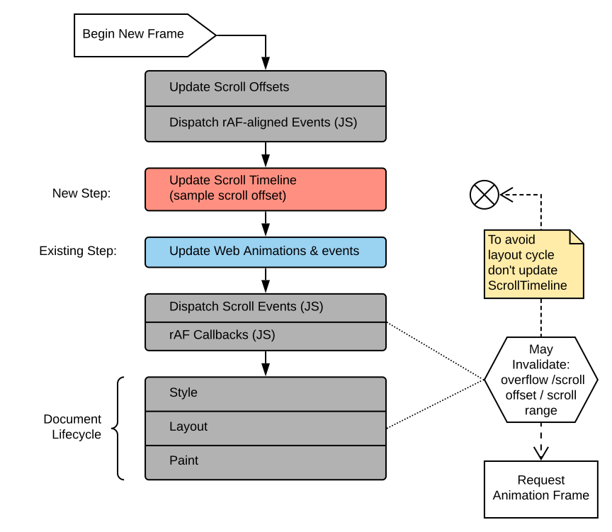

# Scroll-linked Animations Explainer

Note: This document follows the [w3ctag best-practice](https://w3ctag.github.io/explainers) for
explainers.

## Participate
[Issue tracker](https://github.com/w3c/csswg-drafts/labels/scroll-animations)

## Introduction

Scroll-linked animations are a common UX pattern on the web. We are proposing a new API that works
in conjunction with existing [Web Animations](https://drafts.csswg.org/web-animations/) and [CSS
Animations](https://drafts.csswg.org/css-animations/) APIs to enable declarative scroll-linked
animations to improve their smoothness and ergonomics. In  Web Animations, an
[AnimationTimeline](https://drafts.csswg.org/web-animations/#timelines) is the source of time
progress that drives the animations. ScrollTimeline is a new timeline whose function is to
translate “changes in scroll position” of an element into “changes in time”. This allows animations
to be driven by scrolling as opposed to by wall clock thus taking advantage of all existing
animation machinery on the web.

## Motivating Use Cases and Goals

Scroll-linked animated effect are common in web design:
* Parallax Effects
* Reveal/Unreveal effects
* Image Zoom effects
* Progress-bar animations
* Scroll-driven Before/After Image slider
* Creative scroll-driven story-telling


Currently the only way to achieve them is to respond to scroll events on the main thread. This
means that these animations have to run on the main thread which leads to two main problems:
1. Modern browsers perform scrolling on separate thread/process so scroll events are delivered
   asynchronously.
2. Main thread animations are subject to jank.

These make creating performant scroll-linked animations that are in-sync with
scrolling impossible or [very
difficult](https://developers.google.com/web/updates/2016/12/performant-parallaxing).


Our primary goal is to enable declarative scroll-linked animations that can be easily moved off
main thread similar to existing time-based web animations. Our secondary goal is to bring
scroll-linked animation under the existing common web-animation model allowing them to be created,
inspected, controlled via a common animations API.

### Non-goals

#### Scroll-triggered animations

These are a class of animation whose progress is driven by time but whose activation may be
triggered when scrolling past a certain position or into a given scroll range.  These are also
common on the web but they don't suffer from main thread jank and synchronous scrolling lad in the
same way that scroll-linked animations do. This is because only their activation is tied to scroll
position and not their progress.

However, we found that in the vast majority of cases where a web author would want to do this, they
would want to do it for a CSS transition (as opposed to a CSS animation). Unfortunately, it's not
possible to trigger CSS transitions from the compositor thread (because triggering a transition
requires style resolution, which cannot be performed on the compositor thread).

Earlier versions of this specification included a triggering mechanism. But given the extent to
which triggering complicated the API and because of the smaller benefit that these type of
animation will receive, we decided it wasn't worth it if you can't use it for transitions, so this
feature was remove and scroll-triggered animations are non-goal for this API.


At the moment, the current best practice is to use IntersectionObserver to kick-off such animation
which seems sufficient. Other alternative ideas (`:ever-been-visible` pseudo class or generic
animation-trigger) have been proposed
[here](https://github.com/w3c/csswg-drafts/issues/4339#issuecomment-499666491) that the current
ScrollTimeline proposal does not prohibit. The design space for triggering animations is still open
and we welcome input on this subject for future revisions in this specification.

#### Stateful scripted scroll driven animations

Some scroll-linked animations may not fit well within declarative animations such as those that
depend on scroll velocity, or direction, or have custom per frame logic. We believe these can
continue to be solved using rAF (and in future be made more efficient with [Houdini Animation
Worklet](https://drafts.css-houdini.org/css-animationworklet/)). ScrollTimeline may be used in
conjunction with these.

## New APIs

The [Scroll-linked Animations](https://drafts.csswg.org/scroll-animations-1/) spec introduces one
new concept: ScrollTimeline

### Scroll Timeline

A [ScrollTimeline](https://drafts.csswg.org/scroll-animations-1/#scrolltimeline-interface) is an
[AnimationTimeline](https://drafts.csswg.org/web-animations-1/#the-animationtimeline-interface)
whose time values are determined not by wall-clock time, but by the progress of scrolling in a
[scroll container](https://drafts.csswg.org/css-overflow-3/#scroll-container). A ScrollTimeline
converts a position in a scroll range to a time value. The goal is to integrate into the [Web
Animations](https://www.w3.org/TR/web-animations-1/) spec which is built around time. The time
value it produces is determined by the following algorithm:

```
Timeline current time = ((current scroll offset - start) /
    (end - start)) * effective time range
```

A ScrollTimeline is specified by a number of parameters:
* **[source](https://drafts.csswg.org/scroll-animations-1/#dom-scrolltimeline-source)**: The
  scrollable element whose scrolling triggers the activation and drives the progress of the
  timeline.
* **[orientation](https://drafts.csswg.org/scroll-animations-1/#dom-scrolltimeline-orientation)**:
  Determines the scrolling orientation which triggers the activation and drives the progress of the
  trigger.
* **[start](https://drafts.csswg.org/scroll-animations-1/#dom-scrolltimeline-start)**: A scroll
  offset, in the direction specified by orientation, which constitutes the beginning of the range
  in which the timeline is active.
* **[end](https://drafts.csswg.org/scroll-animations-1/#dom-scrolltimeline-end)**: A scroll offset,
  in the direction specified by orientation, which constitutes the end of the range in which the
  trigger is activated.
* **[timeRange](https://drafts.csswg.org/scroll-animations-1/#dom-scrolltimeline-timerange)**: A
  time duration that maps from the fraction-of-scroll that ScrollTimeline calculates, to the time
  value that the Web Animations spec needs.

#### JavaScript APIs

```html
<div class="target"></div>
<div class="scroller">  <!-- 100x100 viewport -->
  <div class="contents"></div>  <!-- 500x500 -->
</div>

<script>
  // Showing all options, though some are set to their default (marked).
  const scrollTimeline = new ScrollTimeline({
      source: scroller,
      orientation: 'block',  // Default value.
      start: 'auto',  // Default value.
      end: 'auto',  // Default value.
      timeRange: 1000,  // Could be set to its default 'auto' value too.
  });
  const effect = new KeyframeEffect(target, { opacity: [1, 0] }, 1000);
  const animation = new Animation(effect, scrollTimeline);
  animation.play();
</script>
```

#### CSS syntax

We are introducing a new `@scroll-timeline` rule similar to the existing `@keyframes` rule. This will allow
scroll-linked animation to be specified in CSS.

Here is an example to demonstrate this which fades the target as `#scroller` scroll from zero to
max.

```css
#target {
  animation: 1s fade;
}

@keyframes fade {
  from { opacity: 1 }
  to { opacity: 0 }
}

@scroll-timeline fade {
  source: selector(#scroller);
}
```

It is possible to use a timeline name that is different from the animation name and use the
`animation-timeline` property to associate a single timeline with multiple animations. Here is a
more complex example of colliding circles that demonstrates this:

```css
div.circle {
  animation-duration: 1s;
  animation-timing-function: linear;
  animation-fill-mode: forwards;
}
#left-circle {
  animation-name: left-circle;
  animation-timeline: collision-timeline;
}
#right-circle {
  animation-name: right-circle;
  animation-timeline: collision-timeline;
}
#union-circle {
  animation-name: union-circle;
  animation-timeline: union-timeline;
}

@scroll-timeline collision-timeline {
  source: selector(#container);
  direction: block;
  start:  200px;
  end: 300px;
}

@scroll-timeline union-timeline {
  source: selector(#container);
  direction: block;
  start:  250px;
  end: 300px;
}

@keyframes left-circle {
  to { transform: translate(300px) }
}
@keyframes right-circle {
  to { transform: translate(350px) }
}
@keyframes union-circle {
  to { opacity: 1 }
}
```

#### Element-based start/end offsets

A very common usage pattern for scroll timeline is that the animation is not based on the absolute
scroll position, but instead based on the location of an element within the scroller. Most commonly
this is when the element enters the scroller viewport and the element in question is usually the
one which is being animated and the scroller is usually the document viewport. To address this, we
are allowing scroll timeline's start and end offsets to be declared in terms of elements on the
page. More accurately as a single intersection threshold (with a similar semantic as
IntersectionObserver) between the scroll timeline's scroll source and another element.


Here is a simple example that shows how this can be used to fade-in an element as it enters the
viewport until it becomes fully visible. This is a WIP proposal and has not been fully specified.
See [here](https://github.com/w3c/csswg-drafts/issues/4337) for more examples and details.


```javascript

const scroller = document.getElementById("scroller");
const image = document.getElementById("image");

const revealTimeline = new ScrollTimeline({
  // Timeline starts at the offset that corresponds with image starting
  // to enter scrollport (i.e., 0% intersect with scroller at its “end” edge).
  start: { target: image, edge: 'end', threshold: 0 },

  // Timeline ends at the offset that corresponds with image becoming
  // fully visible (i.e., 100% intersect with scroller at its “end” edge).
  end: { target: image, edge: 'end', threshold: 1 },
});

const animation = new Animation(
  new KeyframeEffect(
    image,
    { opacity: [0, 1]},
    { duration: 1000, fill: both }
  ),
  revealTimeline
);

animation.play();
```

## Key scenarios

Some of these examples below can already be tried with the existing [Scroll Timeline
polyfill](https://flackr.github.io/scroll-timeline/demo/parallax/index.html).

### Scenario 1 - Parallax


Parallax is one of the most popular scroll-linked effects on the web today. See Android 10 launch
[site](https://www.android.com/android-10/) for an example of this.


To create a parallax effect with ScrollTimeline APIs, one can simply do:

```js
let header = document.querySelector('.header');
document.querySelector('.header > .background').animate({
    transform: ['none', 'translateY(30%)']}, {
    fill: 'both',
    duration: 1000,
    // leaving options empty default using root scroller
    // for its entire scroll range.
    timeline: new ScrollTimeline()
  });
}
```

### Scenario 2 - Reveal/Unreveal

In this UX pattern an element fades in/out or swipes in/out as user scrolls the page. These are
often used to create interactive stories. For example see how New York Times applies scroll-linked
animations for creative
[storytelling](http://www.nytimes.com/projects/2013/tomato-can-blues/index.html).


Here is a simple example where we reveal each header as they enters the viewport. This example uses
the still unspecified element-based offset syntax.


```js
  const headers = document.querySelectorAll('h2, h3');
  for (let i = 0; i < headers.length; i++) {
    const scrollTimeline = new ScrollTimeline({
        start: {target: headers[i], edge: 'end', rootMargin: '-20px'},
        end: {target: headers[i], edge: 'end', threshold: 1, rootMargin: '-20px'},
    });

    headers[i].animate([
        {transform: 'translateX(-10px)', opacity: 0},
        {transform: 'none', opacity: 1}],
        {
          duration: 10000,
          fill: 'both',
          timeline: scrollTimeline
        }
    );
  }
}
```

### Scenario 3 - Progress-bar Animation

Another common example of an animation that tracks scroll position is a progress bar that is used
to indicate the reader’s position in a long article.


Below is a simple example where a progress bar is animate from 0 to full width as we scroll the
document.

``` js
document.querySelector('#progressbar').animate({
    width: [0', '100vw']}, {
    duration: 10000,
    fill: 'both',
    timeline: new ScrollTimeline({
      source: document.scrollingElement
    })
});
```

### Image Zoom In/Out

This is another common usage pattern when an image scales up to fill a larger canvas. For an
example of this see [iPhone 11 launch site](https://www.apple.com/iphone-11/).


In this example we start scaling a DIV as soon as its container fully enters the scrollport and
until it starts existing the scroll port. Not how in this case the animating element is different
from the element that is used to specify the scroll timeline bounds.

```js
const container = document.querySelector('#zoom');
document.querySelector('#zoom > div').animate({
    transform: ['scale(3) translateX(10%)', 'scale(1)']}, {
    duration: 10000,
    fill: 'both',
    timeline: new ScrollTimeline({
        start: {target: container, edge: 'end', threshold: 1},
        end: {target: container, edge: 'start', threshold: 1},
    })
});
}
```

## Detailed design discussion

### Integration with Web Animations

Using Web Animations API was a key decision. On the upside it has many benefits: using established
concepts and models for animation/keyframe/easing etc. This means scroll animations can be created,
controlled, and inspected with existing methods.

Some of the complexities that come from this decision are:

* **Time vs Scroll Offset**: The concept of **time value** (exposed in
  Milliseconds units) are central to the Web Animation model.  This is why
  ScrollTimeline needs `timeRange` to map scroll units into time units. This
  feels odd and artificial. There is a `timeRange: auto` value to help alleviate
  some of this but it is not perfect (see
  [1](https://github.com/w3c/csswg-drafts/issues/4346) and
  [2](https://github.com/w3c/csswg-drafts/issues/4353)). A more principled
  solution has been proposed in the form of Progress-based Animations which
  addresses this issue among other benefits.

* **Exclusive end ranges**: In Web Animations, ranges have exclusive ends to
  help make it easier to use overlapping ranges such as putting multiple
  animations in a sequence. ScrollTimeline scroll range also has exclusive ends
  to match this. However this is problematic for a common case where scroll
  range is full size. Our solution was to [special
  case](https://github.com/w3c/csswg-drafts/issues/4341) this one.

* **Dynamic Scrollability**: It is possible for a scroller to no longer
  overflow (`overflow: auto`). It is not clear how best to model this behavior.
  One option is to model this as an idle timeline. One current limitation of web
  animation is that when a timeline goes from playing to idle, its attached
  animations need to be explicitly played again (call to `animation.play()`). We
  are still working on finding the best solution here to avoid this need.

### Avoiding Layout Cycle

The ability for scrolling to drive the progress of an animation, gives rise to the possibility of
layout cycles, where a change to a scroll offset causes an animation’s effect to update, which in
turn causes a new change to the scroll offset. Imagine that an animation shrinks the height of the
content of the scroller which may cause the max scroll offset to reduce which may change the scroll
offset.

To avoid such layout cycles, animations with a ScrollTimeline are sampled once per frame, after
scrolling in response to input events has taken place, but before `requestAnimationFrame()`
callbacks are run. If the sampling of such an animation causes a change to a scroll offset, the
animation will not be re-sampled to reflect the new offset until the next frame.



Note that this ensures the output of scroll-linked animation is always up-to-date when the user is
scrolling and avoids layout cycle. But it also means that in some situations the rendered scroll
offset may not be consistent with the output of scroll-driven animations. For example when the
scroll-linked animation itself is indirectly causing the scroll offset to change. We believe this
is rare and often not actually desired by authors.


Another thing to note is that if one updates scroll offsets in a `requestAnimationFrame` callback
it is not reflected in scroll-linked animations in the same frame. This is because
`requestAnimationFrame` callback are specified to run after updating web animations step which includes
scroll-linked animations.

### Accommodate Asynchronous Scrolling

Most modern browsers [perform scrolling
asynchronously](https://blogs.windows.com/msedgedev/2017/03/08/scrolling-on-the-web/) to ensure
smoothness and responsiveness to user actions. In other words the majority of scrolling is handled
off main-thread. We have opted for the following model to ensure that is not affected:

1. The scroll-linked effects are expressed declaratively similar to other
   web-animations and may be sampled asynchronously.
2. The user-agent is allowed to sample scroll-linked animations more often than main
   thread animation frames.
3. The user-agent is allowed to sample the scroll-linked effects on main-thread once
   per main-thread animation frame and use the last known scroll offset.


(1) and (2) mean that scroll-linked animation can potentially run off-main thread and in sync with
asynchronous scrolling that happens off thread. (3) ensures they can also run on main-thread
without forcing scrolling itself to be on main thread. Together they guarantee that scroll-linked
animations would render as often as the current existing approach of using scroll events while also
enabling user-agents to optimize such animations to potentially run off-thread and in sync with
asynchronous scrolling.

### Progress-Based Animations

As mentioned before we like to eliminate the need for `ScrollTimeline.timeRange` to map scroll
units into time units. One approach we are exploring is the addition of progress-based animations
to Web Animations. This will allow the scroll timeline to produce a “progress” value which can
drive animations without a need for durations. Progress-based animations will have other value
beside scroll linked-animations. This is a work-in-progress and there is an ongoing discussion
around it [here](https://github.com/w3c/csswg-drafts/issues/4862).

### Access top-level window scroll in iframes

It is desirable to perhaps allow scroll-linked animations to respond to the top-level window
viewport in an iframe. The current specification does not allow this as we are not sure of the
security impact of enabling this in cross-origin iframes. But in terms of API it may be just as
simple of allowing empty source attributes to mean top-level window scroller. More discussion on
the use case and possible solutions are [here](https://github.com/w3c/csswg-drafts/issues/4344)

###  Logical Scrolling vs Animation of Physical properties

This is not an issue directly related to Scroll-linked animation but one that gets exposed more
clearly with it. The issue is that many CSS properties, most predominantly transform, are physical
but ScrollTimeline orientation is logical in that it can be affected by writing-mode). So authors
have to be careful to use physical orientation with a scroll timeline if they intend to use it to
animate physical properties. More details on this [issue
here](https://github.com/w3c/csswg-drafts/issues/4350#issue-495584798).  Long-term, perhaps we
should consider [logical transforms](https://github.com/w3c/fxtf-drafts/issues/311) (also
[this](https://github.com/w3c/csswg-drafts/issues/1788)).

## Considered alternatives

### CSS Syntax Alternatives
We have considered alternatives function based css syntax but decided to go with a @scroll-timeline
rule instead. See additional CSSWG discussion
[here](https://github.com/w3c/csswg-drafts/issues/4338).


### Element-based start/end Offsets Alternatives

A common usage pattern for scroll-linked animation is to start animation when an element enters
scrollport (or viewport) until it leaves viewport. The current proposal achieves this by allowing
start/end offset to be declared in terms of intersection of the scroller and one of its
descendants. This is still a work-in-progress but most of the details are spelled out
[here](https://github.com/w3c/csswg-drafts/issues/4337).

Below are alternatives we have considered:

1. Only expose static offsets and leave it to authors to compute these offset based on element and
   scroller bounding client rects. While this seems simple on surface but putting the onus on
   authors has a number of problems: Also requiring `getBoundingClientRect()` usage can cause layout
   thrashing if not careful. Anything else that affects layout such as new content added to the page
   may invalidate these offsets. So authors have to ensure they correctly recompute these offsets.
   Worst still, some size changes such as ping-zooms may not be easily detectable.

2. Use scroll-snap like alignment syntax (at the moment only exists in CSS). This may be a viable
   alternative compared to intersection observer style syntax (at the moment only exists in JS).
   One argument is that most element-based effects are defined as elements entering/exiting the
   viewport which are more naturally expressed as intersections as opposed to alignments. However
   this is open to debate and feedback is welcome.

## CSS animation-timebase

This is an [idea](https://lists.w3.org/Archives/Public/www-style/2014Sep/0135.html) that most
closely matches the spirit of this current proposal. It proposed css syntax that allows animations
to be scrubbed in response to scroll. It also suggests a syntax for trigger. The current proposal
captures most of the functionality proposed for animation-timebase and defines exactly how it
integrates with web animations.


### Exposed Scroll Offset in Worker/Worklet
This is an idea that was first proposed in Compositor Worker and then was explored more in [Houdini
Animation Worklet](https://github.com/w3c/css-houdini-drafts/tree/master/css-animationworklet). The
idea was to simply expose scroll offset to special JS based `animate()` callbacks that can run off
thread. We believe ScrollTimeline can be used in conjunction with Houdini Animation Worklet thus
there is no need to expose scroll offsets directly. This can enable more complex scroll-linked
animations using Animation Worklet while also making it easy to create fully declarative animations
for common simpler use cases via Web Animations.

Another [take on this idea](https://github.com/w3c/csswg-drafts/issues/2493) was to change Web
Animations time value to no longer be scalar but value could be a bag of values which may be scroll
positions, touch position etc. This combined with custom js animation callback, such as Animation
Worklet, could allow very sophisticated scroll-linked animations but this was also scrapped as we
believed this may not be compatible with the Web Animation model.


## Stakeholder Feedback / Opposition
Safari, Mozilla, Chrome, Edge are participating in CSSWG and have been supportive of the idea.
There are engineers from all four browsers as editors in the specification.

Additional links
 - [Mozilla standard positions](https://github.com/mozilla/standards-positions/issues/347)
 - [Chromium status](https://chromestatus.com/feature/6752840701706240)
 - [WebKit-dev thread](https://lists.webkit.org/pipermail/webkit-dev/2020-June/031228.html)


## References & acknowledgements
Many thanks for valuable contributions, feedback and advice from:
 * All current and former specification editors.
 * CSSWG members for valuable feedback on this proposal.
 * Yi Gu <yigu@google.com> for contributing to this explainer.

